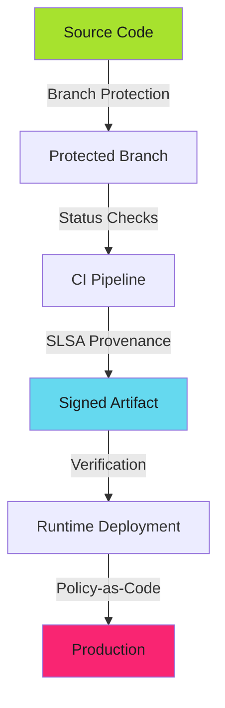

# SLSA Implementation Playbook - Examples


## Example 1: example-1.yaml


```yaml
jobs:
  provenance:
    permissions:
      actions: read
      id-token: write
      contents: write
    uses: slsa-framework/slsa-github-generator/.github/workflows/generator_generic_slsa3.yml@v2.1.0
    with:
      base64-subjects: "${{ needs.build.outputs.hashes }}"
      upload-assets: true
```


## Example 2: example-2.mermaid





