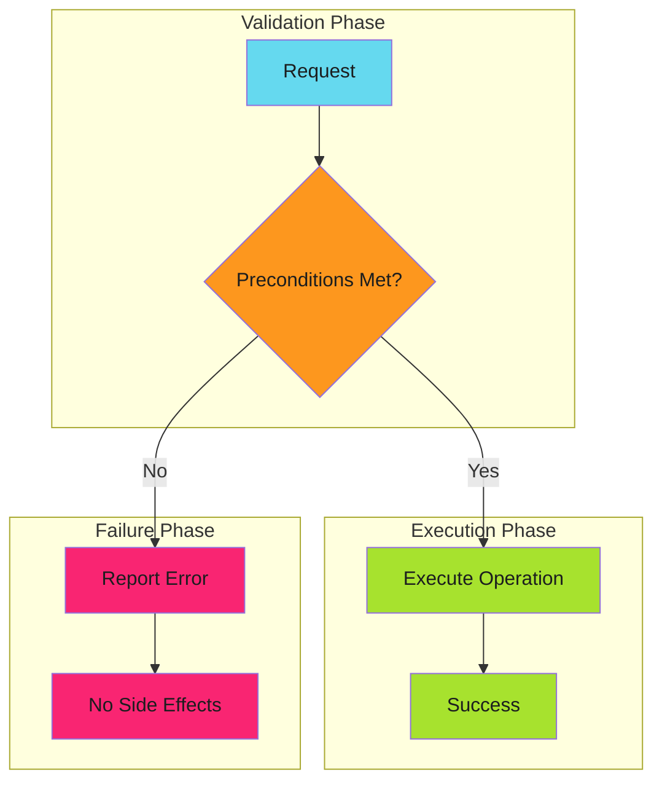

# Fail Fast

## When to Use This Skill

Fail fast is a design pattern that validates preconditions before executing expensive or irreversible operations. When validation fails, the system immediately reports the error rather than proceeding and failing later in an unpredictable state.

The key insight: **fail before you start, not in the middle**.

---

## Implementation

See the full implementation guide in the source documentation.

## Examples

See [examples.md](examples.md) for code examples.

## References

- [Source Documentation](https://adaptive-enforcement-lab.com/patterns/error-handling/)
- [AEL Patterns](https://adaptive-enforcement-lab.com/patterns/)
