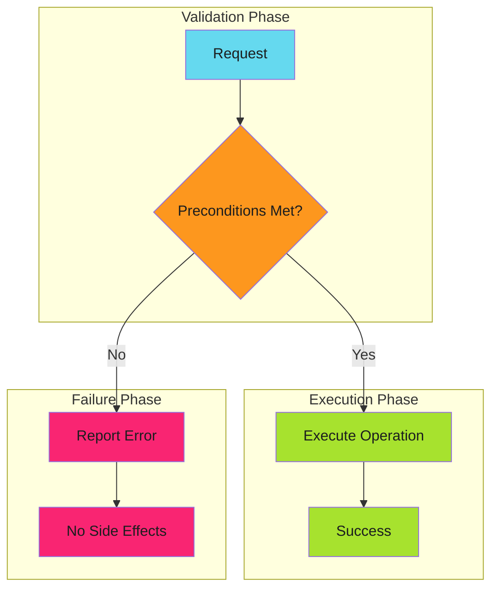

# Fail Fast

## When to Use This Skill

Fail fast is a design pattern that validates preconditions before executing expensive or irreversible operations. When validation fails, the system immediately reports the error rather than proceeding and failing later in an unpredictable state.



The key insight: **fail before you start, not in the middle**.

---


## When to Apply

| Scenario | Apply Fail Fast? | Reasoning |
| ---------- | ------------------ | ----------- |
| Invalid user input | Yes | User error, report immediately |
| Missing required config | Yes | Can't continue safely |
| Insufficient permissions | Yes | Operation will fail anyway |
| Resource allocation failure | Yes | Partial allocation is worse |
| Network timeout | No | Use [graceful degradation](../graceful-degradation/index.md) |
| Cache miss | No | Expensive path still works |

**Decision rule**: Fail fast on **precondition failures**. Degrade gracefully on **runtime failures**.

---


## Implementation

### GitHub Actions Workflow Validation


*See [examples.md](examples.md) for detailed code examples.*

### Go Function with Precondition Validation


*See [examples.md](examples.md) for detailed code examples.*

---


## Techniques


### Fail Fast Techniques

Comprehensive techniques for implementing fail fast patterns:

### [Early Termination](techniques/early-termination.md)

Stop execution immediately when errors occur:

- Shell strict mode (`set -euo pipefail`)
- GitHub Actions matrix fail-fast
- Go error propagation
- Circuit breakers

### [Strict Mode Execution](techniques/strict-mode.md)

Enable strictest validation and error detection:

- Shell/TypeScript/Go strict modes
- Linter enforcement
- Schema validation

### [Assertion Patterns](techniques/assertions.md)

Validate assumptions and fail if they're wrong:

- Runtime assertions
- Contract validation (pre/post conditions)
- Invariant checks
- Type guards

### [Error Escalation](techniques/error-escalation.md)

Determine when to throw vs return, panic vs recover:

- Throw vs return error
- Error aggregation vs first-error-wins
- Panic vs recoverable errors
- Exit codes

### [Timeout Enforcement](techniques/timeouts.md)

Prevent operations from running indefinitely:

- Operation timeouts
- Job timeouts
- Circuit breaker timeouts
- Deadlock detection

---

*See [reference.md](reference.md) for additional techniques and detailed examples.*


## Comparison

These patterns are **complementary**, not contradictory:


*See [examples.md](examples.md) for detailed code examples.*

| Error Type | Pattern | Example |
| ------------ | --------- | --------- |
| Missing config | Fail Fast | Can't start without database URL |
| Database timeout | Graceful Degradation | Retry, then use cache |
| Invalid input | Fail Fast | Reject malformed request |
| API unavailable | Graceful Degradation | Use backup endpoint |
| Insufficient permissions | Fail Fast | Don't attempt forbidden operation |
| Rate limited | Graceful Degradation | Exponential backoff |

---


## Anti-Patterns to Avoid

### 1. Late Validation

Validating after side effects have occurred.


*See [examples.md](examples.md) for detailed code examples.*

### 2. Swallowing Errors

Continuing despite failures.


*See [examples.md](examples.md) for detailed code examples.*

### 3. Partial Execution

Executing some operations before checking all preconditions.


*See [examples.md](examples.md) for detailed code examples.*

### 4. Vague Error Messages

Failing fast but not explaining why.

```bash
# Bad: unhelpful error
[ -f "$CONFIG" ] || exit 1

# Good: actionable error message
[ -f "$CONFIG" ] || { echo "Config file not found: $CONFIG. Create it from config.example.yml"; exit 1; }
```

---


## Examples

See [examples.md](examples.md) for code examples.


## Full Reference

See [reference.md](reference.md) for complete documentation.
## References

- [Source Documentation](https://adaptive-enforcement-lab.com/patterns/error-handling/)
- [AEL Patterns](https://adaptive-enforcement-lab.com/patterns/)
