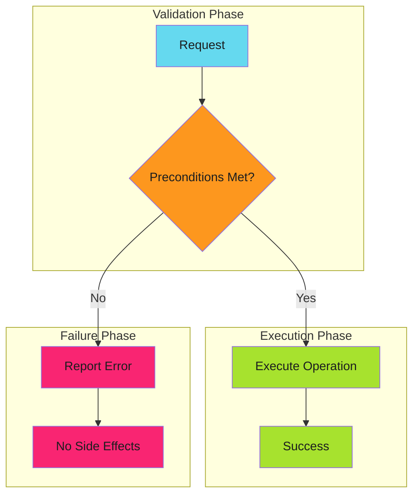
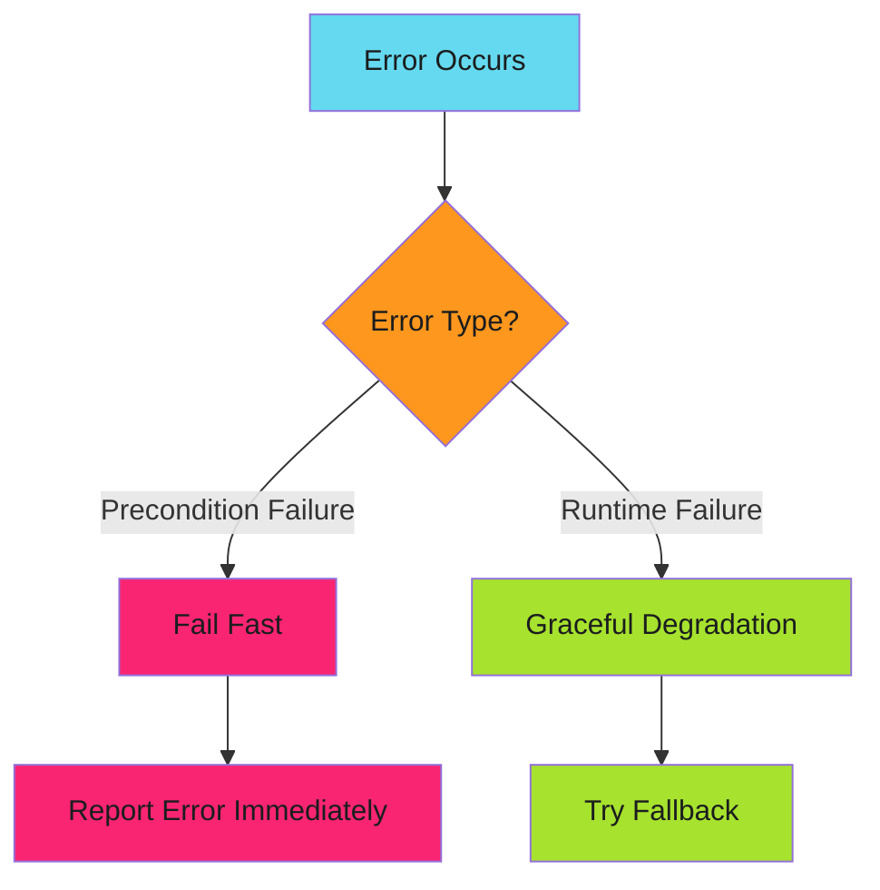

# Fail Fast - Examples


## Example 1: example-1.mermaid





## Example 2: example-2.yaml


```yaml
jobs:
  validate:
    runs-on: ubuntu-latest
    steps:
      # Fail fast: Check all preconditions before expensive operations
      - name: Validate environment
        run: |
          # Required secrets
          [ -n "${{ secrets.DEPLOY_TOKEN }}" ] || { echo "::error::DEPLOY_TOKEN not set"; exit 1; }

          # Required tools
          command -v kubectl >/dev/null || { echo "::error::kubectl not found"; exit 1; }

          # Required access
          kubectl auth can-i create deployments || { echo "::error::No deploy permission"; exit 1; }

      # Now safe to proceed with expensive operations
      - name: Deploy
        run: kubectl apply -f manifests/
```


## Example 3: example-3.go


```go
func ProcessOrder(order *Order) error {
    // Fail fast: validate all preconditions upfront
    if order == nil {
        return errors.New("order is nil")
    }
    if order.CustomerID == "" {
        return errors.New("customer ID required")
    }
    if len(order.Items) == 0 {
        return errors.New("order has no items")
    }
    if order.Total <= 0 {
        return errors.New("invalid order total")
    }

    // All preconditions met, safe to proceed
    return processValidOrder(order)
}
```


## Example 4: example-4.mermaid





## Example 5: example-5.go


```go
// Bad: creates file before validating
func ProcessFile(path string, data []byte) error {
    f, err := os.Create(path)
    if err != nil {
        return err
    }
    defer f.Close()

    if len(data) == 0 {
        return errors.New("empty data")  // File already created!
    }
    return f.Write(data)
}

// Good: validate before side effects
func ProcessFile(path string, data []byte) error {
    if len(data) == 0 {
        return errors.New("empty data")
    }

    f, err := os.Create(path)
    if err != nil {
        return err
    }
    defer f.Close()

    return f.Write(data)
}
```


## Example 6: example-6.yaml


```yaml
# Bad: ignores validation failure
- name: Validate and deploy
  run: |
    ./validate.sh || true  # Swallowed!
    ./deploy.sh

# Good: fail on validation error
- name: Validate
  run: ./validate.sh

- name: Deploy
  run: ./deploy.sh
```


## Example 7: example-7.go


```go
// Bad: partial execution on failure
func TransferFunds(from, to string, amount int) error {
    if err := debit(from, amount); err != nil {
        return err
    }
    // What if 'to' account doesn't exist?
    if err := credit(to, amount); err != nil {
        return err  // Money debited but not credited!
    }
    return nil
}

// Good: validate everything first
func TransferFunds(from, to string, amount int) error {
    // Validate all preconditions
    if !accountExists(from) {
        return errors.New("source account not found")
    }
    if !accountExists(to) {
        return errors.New("destination account not found")
    }
    if balance(from) < amount {
        return errors.New("insufficient funds")
    }

    // Now safe to execute
    return executeTransfer(from, to, amount)
}
```


## Example 8: example-8.sh


```bash
# Bad: unhelpful error
[ -f "$CONFIG" ] || exit 1

# Good: actionable error message
[ -f "$CONFIG" ] || { echo "Config file not found: $CONFIG. Create it from config.example.yml"; exit 1; }
```


