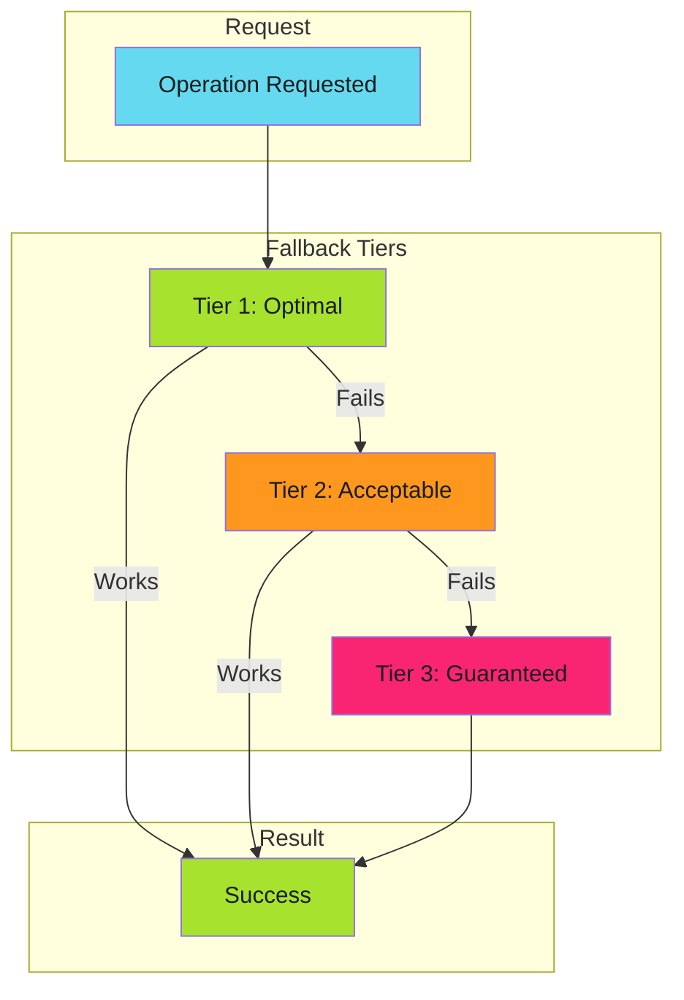

# Graceful Degradation

## When to Use This Skill

Graceful degradation is a design principle that ensures systems continue operating when components fail. Rather than crashing or returning errors, the system automatically falls back to slower but working alternatives.

The key insight: **degrade performance, not availability**.

---

## Implementation

See the full implementation guide in the source documentation.

## Examples

See [examples.md](examples.md) for code examples.

## References

- [Source Documentation](https://adaptive-enforcement-lab.com/patterns/error-handling/)
- [AEL Patterns](https://adaptive-enforcement-lab.com/patterns/)
