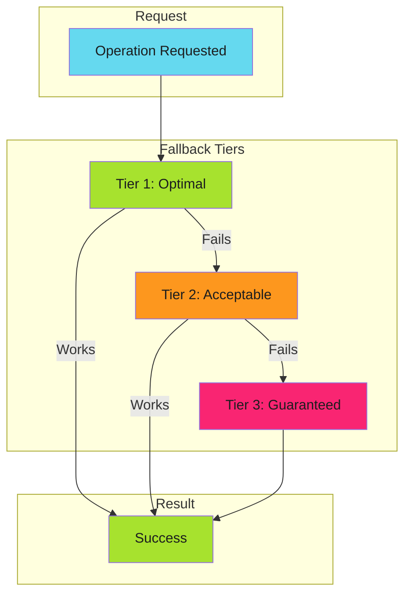

# Graceful Degradation - Examples


## Example 1: example-1.mermaid





## Example 2: example-2.text


```text
Volume Mount → API Call → Rebuild Cache
    1-5ms        50ms        5000ms
```


## Example 3: example-3.yaml


```yaml
# Kubernetes volume mount with optional flag
volumes:
  - name: cache-volume
    configMap:
      name: deployment-cache
      optional: true  # Tier 1 can fail gracefully
```


## Example 4: example-4.go


```go
func GetDeployments(image string) ([]Deployment, error) {
    // Tier 1: Try volume mount
    if data, err := os.ReadFile("/etc/cache/deployments.json"); err == nil {
        return parseDeployments(data, image)
    }

    // Tier 2: Try API call
    if data, err := k8s.GetConfigMap("deployment-cache"); err == nil {
        return parseDeployments(data, image)
    }

    // Tier 3: Rebuild from cluster scan
    return scanClusterForImage(image)
}
```


## Example 5: example-5.text


```text
Artifact Cache → Dependency Cache → Fresh Install
    seconds          minutes          minutes+
```


## Example 6: example-6.yaml


```yaml
- uses: actions/cache@v4
  id: artifact-cache
  with:
    path: dist/
    key: build-${{ hashFiles('src/**') }}

- uses: actions/cache@v4
  if: steps.artifact-cache.outputs.cache-hit != 'true'
  id: dep-cache
  with:
    path: node_modules/
    key: deps-${{ hashFiles('package-lock.json') }}

- name: Install dependencies
  if: steps.dep-cache.outputs.cache-hit != 'true'
  run: npm ci

- name: Build
  if: steps.artifact-cache.outputs.cache-hit != 'true'
  run: npm run build
```


## Example 7: example-7.text


```text
Primary Endpoint → Secondary Endpoint → Cached Response → Static Fallback
```


## Example 8: example-8.text


```text
SSO → API Token → Service Account → Anonymous (read-only)
```


## Example 9: example-9.go


```go
// Bad: silent fallback
func getData() []byte {
    if data, _ := cache.Get(); data != nil {
        return data
    }
    return fetchFromAPI()  // No indication we're in degraded mode
}

// Good: observable fallback
func getData() []byte {
    if data, err := cache.Get(); err == nil {
        metrics.CacheHit()
        return data
    }
    metrics.CacheMiss()
    log.Warn("cache miss, falling back to API")
    return fetchFromAPI()
}
```


## Example 10: example-10.go


```go
// Bad: can fail completely
func getConfig() (*Config, error) {
    if cfg := cache.Get(); cfg != nil {
        return cfg, nil
    }
    return api.FetchConfig()  // What if API is also down?
}

// Good: guaranteed fallback
func getConfig() *Config {
    if cfg := cache.Get(); cfg != nil {
        return cfg
    }
    if cfg, err := api.FetchConfig(); err == nil {
        return cfg
    }
    return DefaultConfig()  // Always works
}
```


## Example 11: example-11.yaml


```yaml
# Bad: always does full install
- run: npm ci
- uses: actions/cache/save@v4
  with:
    path: node_modules/

# Good: cache-first approach
- uses: actions/cache@v4
  id: cache
  with:
    path: node_modules/
    key: deps-${{ hashFiles('package-lock.json') }}

- if: steps.cache.outputs.cache-hit != 'true'
  run: npm ci
```


## Example 12: example-12.yaml


```yaml
- name: Report cache tier
  run: |
    if [ "${{ steps.mount-cache.outcome }}" = "success" ]; then
      echo "cache_tier=mount" >> metrics.txt
    elif [ "${{ steps.api-cache.outcome }}" = "success" ]; then
      echo "cache_tier=api" >> metrics.txt
    else
      echo "cache_tier=rebuild" >> metrics.txt
    fi
```


