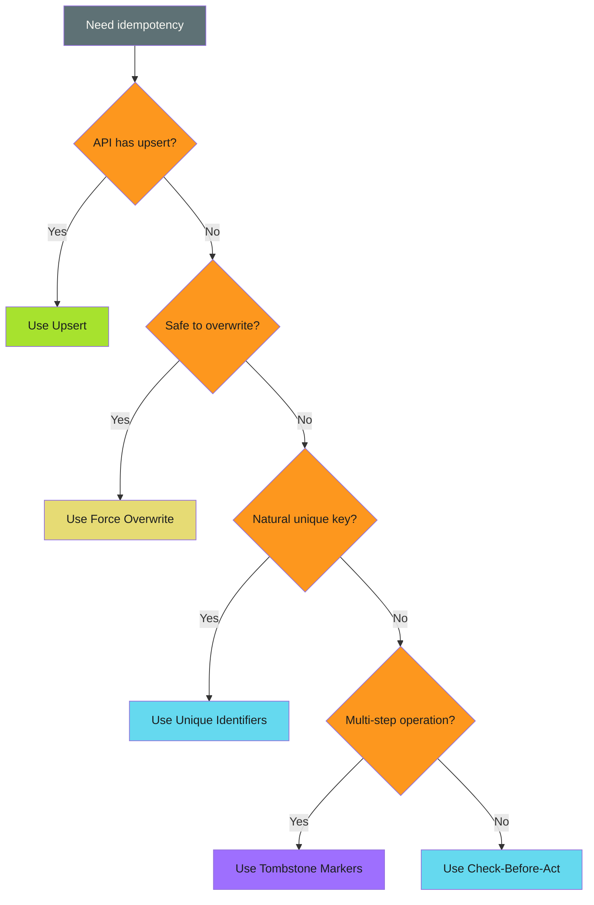

# Implementation Patterns

## When to Use This Skill

| Pattern | Best For | Tradeoff |
| --------- | ---------- | ---------- |
| [Check-Before-Act](check-before-act.md) | Creating resources | Race conditions possible |
| [Upsert](upsert.md) | APIs with atomic operations | Not universally available |
| [Force Overwrite](force-overwrite.md) | Content that can be safely replaced | Destructive if misused |
| [Unique Identifiers](unique-identifiers.md) | Natural deduplication | ID logic can be complex |
| [Tombstone Markers](tombstone-markers/index.md) | Multi-step operations | Markers need cleanup |

---


## Implementation

Five patterns for making operations idempotent. Each has tradeoffs; choose based on your constraints.

---

## Pattern Overview

| Pattern | Best For | Tradeoff |
| --------- | ---------- | ---------- |
| [Check-Before-Act](check-before-act.md) | Creating resources | Race conditions possible |
| [Upsert](upsert.md) | APIs with atomic operations | Not universally available |
| [Force Overwrite](force-overwrite.md) | Content that can be safely replaced | Destructive if misused |
| [Unique Identifiers](unique-identifiers.md) | Natural deduplication | ID logic can be complex |
| [Tombstone Markers](tombstone-markers/index.md) | Multi-step operations | Markers need cleanup |

---

## Quick Reference

### [Check-Before-Act](check-before-act.md)

The most common pattern. Check if the target state exists before attempting to create it.

```bash
if git ls-remote --heads origin "$BRANCH" | grep -q "$BRANCH"; then
  git checkout -B "$BRANCH" "origin/$BRANCH"
else
  git checkout -b "$BRANCH"
fi
```

### [Create-or-Update (Upsert)](upsert.md)

Use APIs or commands that handle both cases atomically.

```bash
gh release create v1.0.0 --notes "Release" || gh release edit v1.0.0 --notes "Release"
```

### [Force Overwrite](force-overwrite.md)

Don't check, just overwrite. Safe when overwriting with identical content is acceptable.

```bash
git push --force-with-lease origin "$BRANCH"
```

### [Unique Identifiers](unique-identifiers.md)

Generate deterministic IDs so duplicate operations target the same resource.

```bash
BRANCH="update-$(sha256sum file.txt | cut -c1-8)"
```

### [Tombstone/Marker Files](tombstone-markers/index.md)

Leave markers indicating operations completed.

```bash
MARKER=".completed-$RUN_ID"
[ -f "$MARKER" ] && exit 0
# Do work...
touch "$MARKER"
```

---

## Choosing a Pattern


*See [examples.md](examples.md) for detailed code examples.*

| Scenario | Recommended Pattern |
| ---------- | ------------------- |
| Creating resources (PRs, branches, files) | [Check-Before-Act](check-before-act.md) |
| Updating existing resources | [Upsert](upsert.md) or [Force Overwrite](force-overwrite.md) |
| Operations with natural keys | [Unique Identifiers](unique-identifiers.md) |
| Complex multi-step operations | [Tombstone Markers](tombstone-markers/index.md) |
| API supports atomic operations | [Upsert](upsert.md) |

> **Combine Patterns**
>
>
> Real-world automation often combines multiple patterns. A workflow might use Check-Before-Act for PR creation, Force Overwrite for branch updates, and Unique Identifiers for naming.

### Pattern Overview

| Pattern | Best For | Tradeoff |
| --------- | ---------- | ---------- |
| [Check-Before-Act](check-before-act.md) | Creating resources | Race conditions possible |
| [Upsert](upsert.md) | APIs with atomic operations | Not universally available |
| [Force Overwrite](force-overwrite.md) | Content that can be safely replaced | Destructive if misused |
| [Unique Identifiers](unique-identifiers.md) | Natural deduplication | ID logic can be complex |
| [Tombstone Markers](tombstone-markers/index.md) | Multi-step operations | Markers need cleanup |

---

### Quick Reference

### [Check-Before-Act](check-before-act.md)

The most common pattern. Check if the target state exists before attempting to create it.

```bash
if git ls-remote --heads origin "$BRANCH" | grep -q "$BRANCH"; then
  git checkout -B "$BRANCH" "origin/$BRANCH"
else
  git checkout -b "$BRANCH"
fi
```

### [Create-or-Update (Upsert)](upsert.md)

Use APIs or commands that handle both cases atomically.

```bash
gh release create v1.0.0 --notes "Release" || gh release edit v1.0.0 --notes "Release"
```

### [Force Overwrite](force-overwrite.md)

Don't check, just overwrite. Safe when overwriting with identical content is acceptable.

```bash
git push --force-with-lease origin "$BRANCH"
```

### [Unique Identifiers](unique-identifiers.md)

Generate deterministic IDs so duplicate operations target the same resource.

```bash
BRANCH="update-$(sha256sum file.txt | cut -c1-8)"
```

### [Tombstone/Marker Files](tombstone-markers/index.md)

Leave markers indicating operations completed.

```bash
MARKER=".completed-$RUN_ID"
[ -f "$MARKER" ] && exit 0
# Do work...
touch "$MARKER"
```

---

### Choosing a Pattern


*See [examples.md](examples.md) for detailed code examples.*

| Scenario | Recommended Pattern |
| ---------- | ------------------- |
| Creating resources (PRs, branches, files) | [Check-Before-Act](check-before-act.md) |
| Updating existing resources | [Upsert](upsert.md) or [Force Overwrite](force-overwrite.md) |
| Operations with natural keys | [Unique Identifiers](unique-identifiers.md) |
| Complex multi-step operations | [Tombstone Markers](tombstone-markers/index.md) |
| API supports atomic operations | [Upsert](upsert.md) |

> **Combine Patterns**
>
>
> Real-world automation often combines multiple patterns. A workflow might use Check-Before-Act for PR creation, Force Overwrite for branch updates, and Unique Identifiers for naming.


## Techniques


### Pattern Overview

| Pattern | Best For | Tradeoff |
| --------- | ---------- | ---------- |
| [Check-Before-Act](check-before-act.md) | Creating resources | Race conditions possible |
| [Upsert](upsert.md) | APIs with atomic operations | Not universally available |
| [Force Overwrite](force-overwrite.md) | Content that can be safely replaced | Destructive if misused |
| [Unique Identifiers](unique-identifiers.md) | Natural deduplication | ID logic can be complex |
| [Tombstone Markers](tombstone-markers/index.md) | Multi-step operations | Markers need cleanup |

---


### Quick Reference

### [Check-Before-Act](check-before-act.md)

The most common pattern. Check if the target state exists before attempting to create it.

```bash
if git ls-remote --heads origin "$BRANCH" | grep -q "$BRANCH"; then
  git checkout -B "$BRANCH" "origin/$BRANCH"
else
  git checkout -b "$BRANCH"
fi
```

### [Create-or-Update (Upsert)](upsert.md)

Use APIs or commands that handle both cases atomically.

```bash
gh release create v1.0.0 --notes "Release" || gh release edit v1.0.0 --notes "Release"
```

### [Force Overwrite](force-overwrite.md)

Don't check, just overwrite. Safe when overwriting with identical content is acceptable.

```bash
git push --force-with-lease origin "$BRANCH"
```

### [Unique Identifiers](unique-identifiers.md)

Generate deterministic IDs so duplicate operations target the same resource.

```bash
BRANCH="update-$(sha256sum file.txt | cut -c1-8)"
```

### [Tombstone/Marker Files](tombstone-markers/index.md)

Leave markers indicating operations completed.

```bash
MARKER=".completed-$RUN_ID"
[ -f "$MARKER" ] && exit 0
# Do work...
touch "$MARKER"
```

---


### Choosing a Pattern



| Scenario | Recommended Pattern |
| ---------- | ------------------- |
| Creating resources (PRs, branches, files) | [Check-Before-Act](check-before-act.md) |
| Updating existing resources | [Upsert](upsert.md) or [Force Overwrite](force-overwrite.md) |
| Operations with natural keys | [Unique Identifiers](unique-identifiers.md) |
| Complex multi-step operations | [Tombstone Markers](tombstone-markers/index.md) |
| API supports atomic operations | [Upsert](upsert.md) |

> **Combine Patterns**
>
>
> Real-world automation often combines multiple patterns. A workflow might use Check-Before-Act for PR creation, Force Overwrite for branch updates, and Unique Identifiers for naming.


## Examples

See [examples.md](examples.md) for code examples.
## References

- [Source Documentation](https://adaptive-enforcement-lab.com/patterns/efficiency/)
- [AEL Patterns](https://adaptive-enforcement-lab.com/patterns/)
