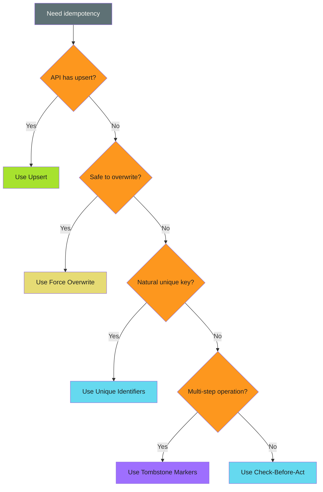

# Implementation Patterns - Examples


## Example 1: example-1.sh


```bash
if git ls-remote --heads origin "$BRANCH" | grep -q "$BRANCH"; then
  git checkout -B "$BRANCH" "origin/$BRANCH"
else
  git checkout -b "$BRANCH"
fi
```


## Example 2: example-2.sh


```bash
gh release create v1.0.0 --notes "Release" || gh release edit v1.0.0 --notes "Release"
```


## Example 3: example-3.sh


```bash
git push --force-with-lease origin "$BRANCH"
```


## Example 4: example-4.sh


```bash
BRANCH="update-$(sha256sum file.txt | cut -c1-8)"
```


## Example 5: example-5.sh


```bash
MARKER=".completed-$RUN_ID"
[ -f "$MARKER" ] && exit 0
# Do work...
touch "$MARKER"
```


## Example 6: example-6.mermaid





