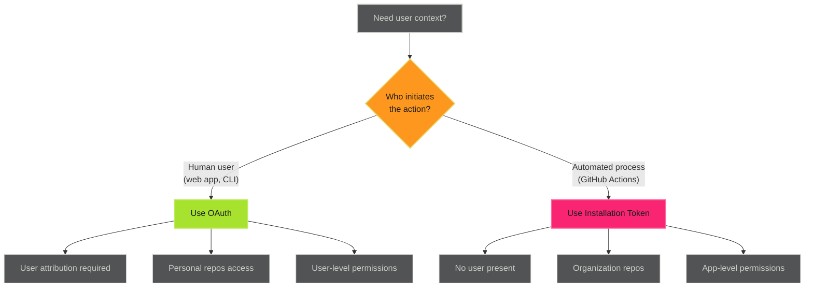
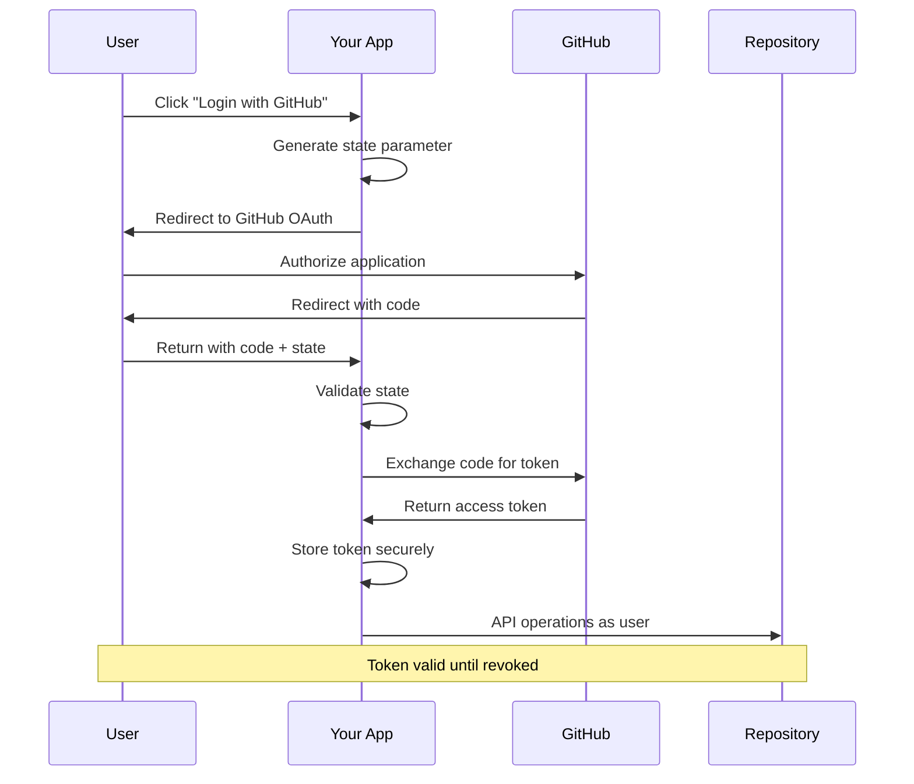

# OAuth User Authentication - Examples


## Example 1: example-1.mermaid





## Example 2: example-2.mermaid





## Example 3: example-3.py


```python
import secrets
import urllib.parse

# Generate state for CSRF protection
state = secrets.token_urlsafe(32)
# Store state in session for later validation

# Your GitHub App OAuth settings
client_id = "Iv1.your_client_id"
redirect_uri = "https://your-app.com/auth/callback"

# Authorization URL
params = {
    'client_id': client_id,
    'redirect_uri': redirect_uri,
    'state': state,
    'scope': 'repo user',  # Request needed scopes
}

auth_url = f"https://github.com/login/oauth/authorize?{urllib.parse.urlencode(params)}"

# Redirect user to auth_url
```


## Example 4: example-4.py


```python
import requests

def handle_oauth_callback(code, state, session_state):
    # Validate state parameter
    if state != session_state:
        raise ValueError("Invalid state parameter - possible CSRF attack")

    # Exchange code for token
    token_url = "https://github.com/login/oauth/access_token"

    payload = {
        'client_id': 'Iv1.your_client_id',
        'client_secret': 'your_client_secret',  # From GitHub App settings
        'code': code,
        'redirect_uri': 'https://your-app.com/auth/callback',
    }

    headers = {
        'Accept': 'application/json',
    }

    response = requests.post(token_url, json=payload, headers=headers)
    response.raise_for_status()

    token_data = response.json()

    return {
        'access_token': token_data['access_token'],
        'token_type': token_data['token_type'],
        'scope': token_data['scope'],
    }
```


## Example 5: example-5.py


```python
def create_issue_as_user(access_token, repo_owner, repo_name, title, body):
    """Create GitHub issue with user attribution"""

    url = f"https://api.github.com/repos/{repo_owner}/{repo_name}/issues"

    headers = {
        'Authorization': f'Bearer {access_token}',
        'Accept': 'application/vnd.github+json',
        'X-GitHub-Api-Version': '2022-11-28',
    }

    payload = {
        'title': title,
        'body': body,
    }

    response = requests.post(url, json=payload, headers=headers)
    response.raise_for_status()

    return response.json()

# Usage
issue = create_issue_as_user(
    access_token=user_token,
    repo_owner='adaptive-enforcement-lab',
    repo_name='example-repo',
    title='User-created issue',
    body='This issue was created by the authenticated user via OAuth',
)

print(f"Created issue #{issue['number']} as {issue['user']['login']}")
```


## Example 6: example-6.py


```python
from flask import Flask, redirect, request, session, url_for
import requests
import secrets

app = Flask(__name__)
app.secret_key = 'your-secret-key-here'  # Use secure secret in production

GITHUB_CLIENT_ID = 'Iv1.your_client_id'
GITHUB_CLIENT_SECRET = 'your_client_secret'
REDIRECT_URI = 'http://localhost:5000/callback'

@app.route('/')
def index():
    if 'github_token' in session:
        return f"""
        <h1>Authenticated!</h1>
        <p>Token: {session['github_token'][:20]}...</p>
        <a href="/create-issue">Create Test Issue</a> |
        <a href="/logout">Logout</a>
        """
    else:
        return '<a href="/login">Login with GitHub</a>'

@app.route('/login')
def login():
    # Generate and store state
    state = secrets.token_urlsafe(32)
    session['oauth_state'] = state

    # Build authorization URL
    params = {
        'client_id': GITHUB_CLIENT_ID,
        'redirect_uri': REDIRECT_URI,
        'state': state,
        'scope': 'repo user',
    }

    auth_url = f"https://github.com/login/oauth/authorize"
    return redirect(f"{auth_url}?{'&'.join(f'{k}={v}' for k, v in params.items())}")

@app.route('/callback')
def callback():
    # Validate state
    if request.args.get('state') != session.get('oauth_state'):
        return 'Invalid state parameter', 400

    # Exchange code for token
    code = request.args.get('code')

    token_response = requests.post(
        'https://github.com/login/oauth/access_token',
        json={
            'client_id': GITHUB_CLIENT_ID,
            'client_secret': GITHUB_CLIENT_SECRET,
            'code': code,
            'redirect_uri': REDIRECT_URI,
        },
        headers={'Accept': 'application/json'},
    )

    token_data = token_response.json()

    # Store token in session (use secure storage in production)
    session['github_token'] = token_data['access_token']

    return redirect(url_for('index'))

@app.route('/create-issue')
def create_issue():
    if 'github_token' not in session:
        return redirect(url_for('login'))

    # Create issue as authenticated user
    response = requests.post(
        'https://api.github.com/repos/adaptive-enforcement-lab/test-repo/issues',
        json={
            'title': 'Test Issue from OAuth',
            'body': 'Created via OAuth user authentication',
        },
        headers={
            'Authorization': f"Bearer {session['github_token']}",
            'Accept': 'application/vnd.github+json',
        },
    )

    issue = response.json()
    return f"Created issue #{issue['number']}"

@app.route('/logout')
def logout():
    session.clear()
    return redirect(url_for('index'))

if __name__ == '__main__':
    app.run(debug=True)
```


