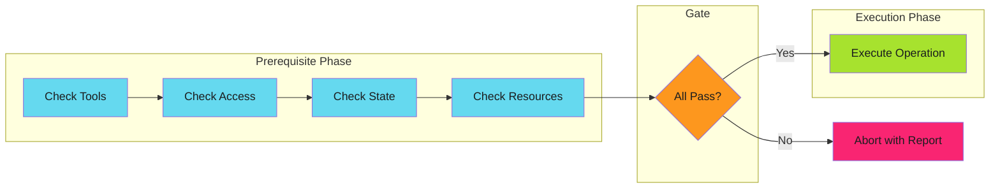

# Prerequisite Checks

## When to Use This Skill

Prerequisite checks are a structured approach to [fail fast](../fail-fast/index.md) validation. Instead of scattering validation throughout code, you consolidate all precondition checks into a dedicated phase that runs before any work begins.

The key insight: **check everything, then do everything**.

---

## Prerequisites

| Category | What to Check | Example | Guide |
| ---------- | --------------- |---------| ------- |
| **Environment** | Required tools and variables | `kubectl`, `$DATABASE_URL` | [Environment](checks/environment.md) |
| **Access** | Permissions are granted | API tokens, RBAC roles | [Permissions](checks/permissions.md) |
| **State** | System is in expected state | Resource exists, not locked | [State](checks/state.md) |
| **Input** | Inputs are valid | Required fields, formats | [Input](checks/input.md) |
| **Dependencies** | Dependencies are ready | Upstream jobs, services | [Dependencies](checks/dependencies.md) |

---

## Implementation

See the full implementation guide in the source documentation.

## Examples

See [examples.md](examples.md) for code examples.

## References

- [Source Documentation](https://adaptive-enforcement-lab.com/patterns/error-handling/)
- [AEL Patterns](https://adaptive-enforcement-lab.com/patterns/)
