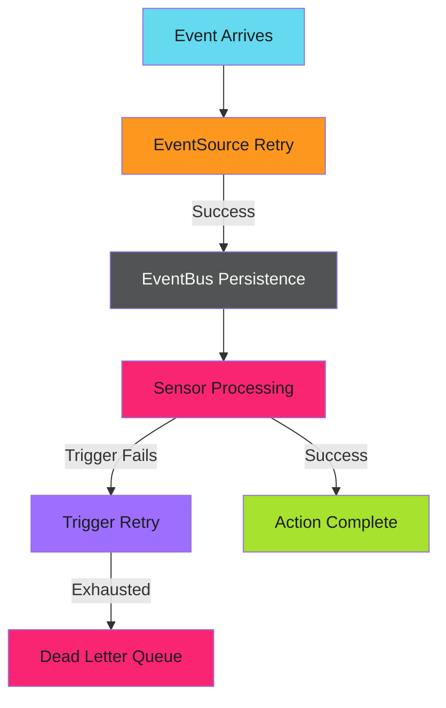

# Reliability Patterns

## When to Use This Skill

Production event systems must handle failures gracefully. Network blips, service outages, and malformed events are inevitable. These patterns ensure events don't get lost and systems recover automatically. For the complete reference, see the [official Argo Events reliability docs](https://argoproj.github.io/argo-events/sensors/more-about-sensors-and-triggers/).

---


## Implementation

See the full implementation guide in the [source documentation](https://adaptive-enforcement-lab.com/patterns/argo-events/).


## Techniques


### Reliability Architecture

Multiple layers of protection prevent event loss:



---


### Reliability Patterns

| Pattern | Purpose | Complexity |
| --------- | --------- | ------------ |
| [Retry Strategies](retry.md) | Handle transient failures | Low |
| [Dead Letter Queues](dead-letter.md) | Capture failed events | Medium |
| [Backpressure Handling](backpressure.md) | Prevent overload | Medium |

---


### Quick Example: Trigger Retry

Add retry logic to handle transient failures:

```yaml
triggers:
  - template:
      name: deploy-with-retry
      argoWorkflow:
        operation: submit
        source:
          resource:
            # ...
    retryStrategy:
      steps: 3
      duration: 10s
      factor: 2
      jitter: 0.1
```

This retries failed triggers up to 3 times with exponential backoff:

- First retry: ~10 seconds
- Second retry: ~20 seconds
- Third retry: ~40 seconds

The jitter adds randomness to prevent thundering herd.

---


### EventBus Durability

The EventBus provides at-least-once delivery. Events persist until acknowledged:

```yaml
apiVersion: argoproj.io/v1alpha1
kind: EventBus
metadata:
  name: default
spec:
  jetstream:
    version: "2.9.11"
    persistence:
      accessMode: ReadWriteOnce
      storageClassName: standard
      volumeSize: 10Gi
    replicas: 3
```

With persistence enabled, events survive EventBus pod restarts. The 3-replica configuration provides high availability.

---

> **At-Least-Once Semantics**
>
> Argo Events guarantees at-least-once delivery, not exactly-once. Your workflows must be idempotent - processing the same event twice should produce the same result. See [Idempotency Patterns](../../efficiency/idempotency/index.md) for implementation strategies.
>

---


### Related

- [Retry Strategies](retry.md) - Transient failure handling
- [Dead Letter Queues](dead-letter.md) - Failed event capture
- [EventBus Configuration](../../../patterns/argo-events/setup/event-bus.md) - Persistence setup
- [High Availability](../../../patterns/argo-events/reliability/high-availability.md) - Production HA architecture
- [Official Reliability Docs](https://argoproj.github.io/argo-events/sensors/more-about-sensors-and-triggers/) - Complete reference


## Examples

See [examples.md](examples.md) for code examples.


## Related Patterns

- Retry Strategies
- Dead Letter Queues
- EventBus Configuration
- High Availability
- Official Reliability Docs

## References

- [Source Documentation](https://adaptive-enforcement-lab.com/patterns/argo-events/)
- [AEL Patterns](https://adaptive-enforcement-lab.com/patterns/)
