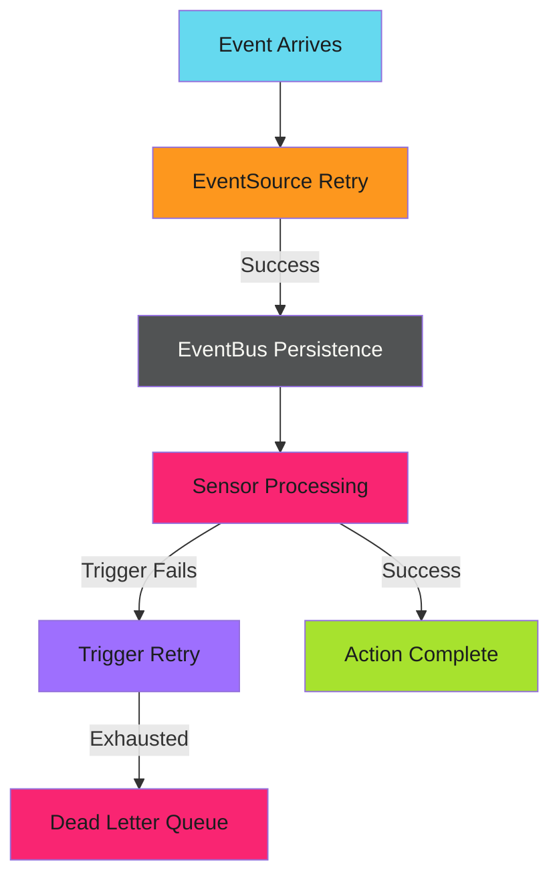

# Reliability Patterns - Examples


## Example 1: example-1.mermaid





## Example 2: example-2.yaml


```yaml
triggers:
  - template:
      name: deploy-with-retry
      argoWorkflow:
        operation: submit
        source:
          resource:
            # ...
    retryStrategy:
      steps: 3
      duration: 10s
      factor: 2
      jitter: 0.1
```


## Example 3: example-3.yaml


```yaml
apiVersion: argoproj.io/v1alpha1
kind: EventBus
metadata:
  name: default
spec:
  jetstream:
    version: "2.9.11"
    persistence:
      accessMode: ReadWriteOnce
      storageClassName: standard
      volumeSize: 10Gi
    replicas: 3
```


