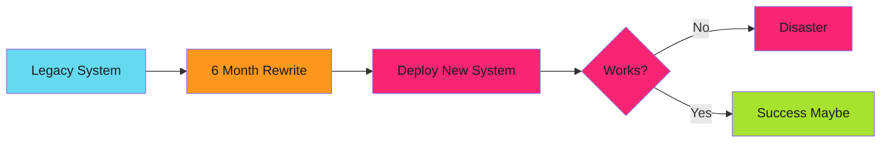
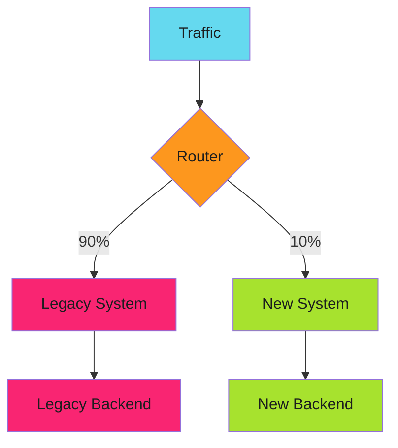

# Strangler Fig - Examples

## Example 1: example-1.mermaid

```mermaid
flowchart LR
    A[Legacy System] --> B[6 Month Rewrite]
    B --> C[Deploy New System]
    C --> D{Works?}
    D -->|No| E[Disaster]
    D -->|Yes| F[Success Maybe]

    %% Ghostty Hardcore Theme
    style A fill:#65d9ef,color:#1b1d1e
    style B fill:#fd971e,color:#1b1d1e
    style C fill:#f92572,color:#1b1d1e
    style D fill:#f92572,color:#1b1d1e
    style E fill:#f92572,color:#1b1d1e
    style F fill:#a7e22e,color:#1b1d1e
```

## Example 2: example-2.mermaid

```mermaid
flowchart TD
    A[Traffic] --> B{Router}
    B -->|90%| C[Legacy System]
    B -->|10%| D[New System]
    C --> E[Legacy Backend]
    D --> F[New Backend]

    %% Ghostty Hardcore Theme
    style A fill:#65d9ef,color:#1b1d1e
    style B fill:#fd971e,color:#1b1d1e
    style C fill:#f92572,color:#1b1d1e
    style D fill:#a7e22e,color:#1b1d1e
    style E fill:#f92572,color:#1b1d1e
    style F fill:#a7e22e,color:#1b1d1e
```

