# Token Lifecycle Management - Examples


## Example 1: example-1.mermaid

```mermaid
gantt

%% Ghostty Hardcore Theme
    title Installation Token Lifecycle
    dateFormat X
    axisFormat %M min

    section Token A
    Valid (60 min)           :active, t1, 0, 60
    Expired                  :crit, 60, 120

    section Refresh Window
    Safe operation           :done, 0, 50
    Refresh recommended      :active, 50, 55
    Critical (refresh now)   :crit, 55, 60
    Token expired            :crit, 60, 120

    section Token B (refreshed)
    Generation               :milestone, 55, 0
    Valid (60 min)           :active, t2, 55, 115
```





## Example 2: example-2.yaml


```yaml
name: Long-Running Workflow with Auto-Refresh

on:
  workflow_dispatch:

jobs:
  long-operation:
    runs-on: ubuntu-latest
    steps:
      - name: Generate token
        id: app_token
        uses: actions/create-github-app-token@v2
        with:
          app-id: ${{ secrets.CORE_APP_ID }}
          private-key: ${{ secrets.CORE_APP_PRIVATE_KEY }}
          owner: adaptive-enforcement-lab

      - name: Long-running operation (2+ hours)
        env:
          GH_TOKEN: ${{ steps.app_token.outputs.token }}
        run: |
          # Action automatically refreshes token in background
          for i in {1..150}; do
            echo "Iteration $i at $(date)"

            # API calls use fresh token automatically
            gh api user --jq .login

            # Sleep for 1 minute (150 iterations = 2.5 hours)
            sleep 60
          done
```


## Example 3: example-3.yaml


```yaml
name: Manual Token Refresh

on:
  workflow_dispatch:

jobs:
  manual-refresh:
    runs-on: ubuntu-latest
    steps:
      - name: Multi-hour operation with manual refresh
        env:
          APP_ID: ${{ secrets.CORE_APP_ID }}
          PRIVATE_KEY: ${{ secrets.CORE_APP_PRIVATE_KEY }}
        run: |
          # Function to generate token
          generate_token() {
            TOKEN=$(gh api /app/installations \
              --jq '.[0].id' | xargs -I {} \
              gh api /app/installations/{}/access_tokens \
              -X POST --jq .token)
            echo "$TOKEN"
          }

          # Function to check if token needs refresh
          needs_refresh() {
            local token_age=$1
            local max_age=3300  # 55 minutes in seconds
            [ $token_age -gt $max_age ]
          }

          # Initial token generation
          export GH_TOKEN=$(generate_token)
          TOKEN_CREATED=$(date +%s)

          # Long-running operation
          for i in {1..150}; do
            # Calculate token age
            CURRENT_TIME=$(date +%s)
            TOKEN_AGE=$((CURRENT_TIME - TOKEN_CREATED))

            # Refresh if needed
            if needs_refresh $TOKEN_AGE; then
              echo "::notice::Token age: $((TOKEN_AGE / 60)) minutes - refreshing"
              export GH_TOKEN=$(generate_token)
              TOKEN_CREATED=$(date +%s)
            fi

            # Perform API operation
            gh api repos/adaptive-enforcement-lab/example-repo \
              --jq '.full_name + " (iteration " + ($i | tostring) + ")"' \
              --arg i "$i"

            sleep 60
          done
```


## Example 4: example-4.yaml


```yaml
name: Step-Based Token Refresh

on:
  workflow_dispatch:

jobs:
  step-refresh:
    runs-on: ubuntu-latest
    steps:
      - name: Generate initial token
        id: token_1
        uses: actions/create-github-app-token@v2
        with:
          app-id: ${{ secrets.CORE_APP_ID }}
          private-key: ${{ secrets.CORE_APP_PRIVATE_KEY }}
          owner: adaptive-enforcement-lab

      - name: Phase 1 (up to 55 minutes)
        env:
          GH_TOKEN: ${{ steps.token_1.outputs.token }}
        run: |
          # First batch of operations
          for repo in repo-1 repo-2 repo-3; do
            gh api repos/adaptive-enforcement-lab/$repo
            # Heavy processing...
            sleep 1000  # ~16 minutes per repo
          done

      - name: Refresh token before phase 2
        id: token_2
        uses: actions/create-github-app-token@v2
        with:
          app-id: ${{ secrets.CORE_APP_ID }}
          private-key: ${{ secrets.CORE_APP_PRIVATE_KEY }}
          owner: adaptive-enforcement-lab

      - name: Phase 2 (next 55 minutes)
        env:
          GH_TOKEN: ${{ steps.token_2.outputs.token }}
        run: |
          # Second batch of operations
          for repo in repo-4 repo-5 repo-6; do
            gh api repos/adaptive-enforcement-lab/$repo
            # Heavy processing...
            sleep 1000
          done
```


## Example 5: example-5.yaml


```yaml
name: Matrix with Token Refresh

on:
  workflow_dispatch:

jobs:
  generate-token:
    runs-on: ubuntu-latest
    outputs:
      token: ${{ steps.app_token.outputs.token }}
    steps:
      - name: Generate fresh token
        id: app_token
        uses: actions/create-github-app-token@v2
        with:
          app-id: ${{ secrets.CORE_APP_ID }}
          private-key: ${{ secrets.CORE_APP_PRIVATE_KEY }}
          owner: adaptive-enforcement-lab

  process:
    needs: generate-token
    runs-on: ubuntu-latest
    strategy:
      matrix:
        repo: [repo-1, repo-2, repo-3, repo-4, repo-5]
    steps:
      - name: Use shared token
        env:
          GH_TOKEN: ${{ needs.generate-token.outputs.token }}
        run: |
          # All matrix jobs use same token
          gh api repos/adaptive-enforcement-lab/${{ matrix.repo }}

  refresh-token:
    needs: process
    runs-on: ubuntu-latest
    if: always()
    outputs:
      token: ${{ steps.new_token.outputs.token }}
    steps:
      - name: Generate refreshed token
        id: new_token
        uses: actions/create-github-app-token@v2
        with:
          app-id: ${{ secrets.CORE_APP_ID }}
          private-key: ${{ secrets.CORE_APP_PRIVATE_KEY }}
          owner: adaptive-enforcement-lab

  continue-processing:
    needs: [process, refresh-token]
    runs-on: ubuntu-latest
    if: always()
    strategy:
      matrix:
        repo: [repo-6, repo-7, repo-8, repo-9, repo-10]
    steps:
      - name: Use refreshed token
        env:
          GH_TOKEN: ${{ needs.refresh-token.outputs.token }}
        run: |
          gh api repos/adaptive-enforcement-lab/${{ matrix.repo }}
```


