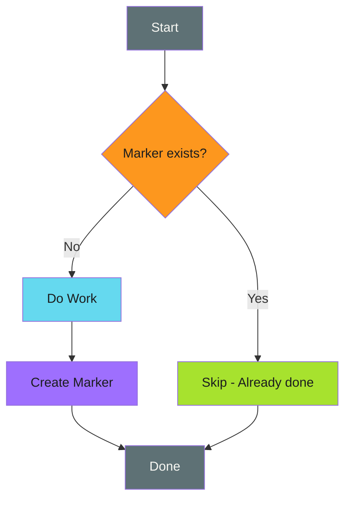

# Tombstone/Marker Files - Examples


## Example 1: example-1.sh


```bash
MARKER=".completed-$OPERATION_ID"

if [ -f "$MARKER" ]; then
  echo "Already completed"
  exit 0
fi

# Do the work...

touch "$MARKER"
```


## Example 2: example-2.mermaid





## Example 3: example-3.sh


```bash
MARKER="/tmp/.migration-completed-v2"

if [ -f "$MARKER" ]; then
  echo "Migration already completed"
  exit 0
fi

run_database_migration

touch "$MARKER"
echo "Migration completed"
```


## Example 4: example-4.sh


```bash
# Unique per workflow run
MARKER=".done-${GITHUB_RUN_ID}-${GITHUB_RUN_ATTEMPT}"

if [ -f "$MARKER" ]; then
  echo "This run already completed"
  exit 0
fi

perform_deployment

touch "$MARKER"
```


## Example 5: example-5.sh


```bash
# Track each item in a batch
process_item() {
  local item="$1"
  local marker=".processed-$(echo "$item" | sha256sum | cut -c1-16)"

  if [ -f "$marker" ]; then
    echo "Skipping $item (already processed)"
    return 0
  fi

  do_work_on "$item"

  touch "$marker"
  echo "Processed $item"
}

for item in "${ITEMS[@]}"; do
  process_item "$item"
done
```


## Example 6: example-6.sh


```bash
MARKER=".completed-$OPERATION"

if [ -f "$MARKER" ]; then
  echo "Completed at: $(cat "$MARKER")"
  exit 0
fi

perform_operation

# Store completion time and details
echo "$(date -Iseconds) by ${GITHUB_ACTOR:-unknown}" > "$MARKER"
```


## Example 7: example-7.sh


```bash
# Use directories for atomic marker creation
MARKER_DIR=".markers/$OPERATION_ID"

if [ -d "$MARKER_DIR" ]; then
  echo "Already completed"
  exit 0
fi

perform_operation

mkdir -p "$MARKER_DIR"
echo "$RESULT" > "$MARKER_DIR/result.json"
```


