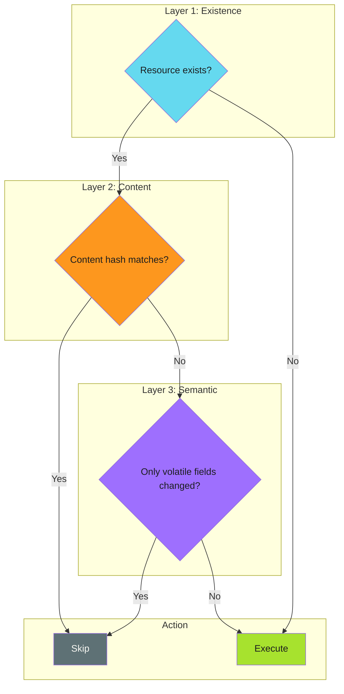

# Work Avoidance Techniques

## When to Use This Skill

Each technique answers a specific question:

| Technique | Question | Best For |
| ----------- | ---------- | ---------- |
| [Content Hashing](content-hashing.md) | "Is the content different?" | File comparisons, config sync |
| [Volatile Field Exclusion](volatile-field-exclusion.md) | "Did anything meaningful change?" | Version bumps, timestamps |
| [Existence Checks](existence-checks.md) | "Does it already exist?" | Resource creation (PRs, branches) |
| [Cache-Based Skip](cache-based-skip.md) | "Is the output already built?" | Build artifacts, dependencies |
| [Queue Cleanup](queue-cleanup.md) | "Should queued work execute?" | Mutex-locked workflows |

---

## Implementation

See the full implementation guide in the [source documentation](https://adaptive-enforcement-lab.com/patterns/efficiency/).

## Techniques

### Overview

Each technique answers a specific question:

| Technique | Question | Best For |
| ----------- | ---------- | ---------- |
| [Content Hashing](content-hashing.md) | "Is the content different?" | File comparisons, config sync |
| [Volatile Field Exclusion](volatile-field-exclusion.md) | "Did anything meaningful change?" | Version bumps, timestamps |
| [Existence Checks](existence-checks.md) | "Does it already exist?" | Resource creation (PRs, branches) |
| [Cache-Based Skip](cache-based-skip.md) | "Is the output already built?" | Build artifacts, dependencies |
| [Queue Cleanup](queue-cleanup.md) | "Should queued work execute?" | Mutex-locked workflows |

---

### Combining Techniques

Techniques can be layered for maximum efficiency:

---

### Choosing a Technique

| Scenario | Recommended Technique |
| ---------- | ---------------------- |
| File distribution with version bumps | [Volatile Field Exclusion](volatile-field-exclusion.md) |
| OCI image rebuilds | [Content Hashing](content-hashing.md) |
| PR/branch creation | [Existence Checks](existence-checks.md) |
| Dependency installation | [Cache-Based Skip](cache-based-skip.md) |
| API state synchronization | [Content Hashing](content-hashing.md) |
| Generated file deployment | [Volatile Field Exclusion](volatile-field-exclusion.md) |
| Idempotent workflows with mutex locks | [Queue Cleanup](queue-cleanup.md) |

---

### Related

- [Work Avoidance Overview](../index.md) - Pattern introduction
- [Anti-Patterns](../anti-patterns.md) - Common mistakes to avoid

## Anti-Patterns to Avoid

Techniques for detecting when work can be safely skipped.

> **Layer Your Checks**
>
> Start with cheap checks (existence), then content hashes, then semantic comparison. Each layer catches different scenarios.
>

---

## Overview

Each technique answers a specific question:

| Technique | Question | Best For |
| ----------- | ---------- | ---------- |
| [Content Hashing](content-hashing.md) | "Is the content different?" | File comparisons, config sync |
| [Volatile Field Exclusion](volatile-field-exclusion.md) | "Did anything meaningful change?" | Version bumps, timestamps |
| [Existence Checks](existence-checks.md) | "Does it already exist?" | Resource creation (PRs, branches) |
| [Cache-Based Skip](cache-based-skip.md) | "Is the output already built?" | Build artifacts, dependencies |
| [Queue Cleanup](queue-cleanup.md) | "Should queued work execute?" | Mutex-locked workflows |

---

## Combining Techniques

Techniques can be layered for maximum efficiency:

*See [examples.md](examples.md) for detailed code examples.*

---

## Choosing a Technique

| Scenario | Recommended Technique |
| ---------- | ---------------------- |
| File distribution with version bumps | [Volatile Field Exclusion](volatile-field-exclusion.md) |
| OCI image rebuilds | [Content Hashing](content-hashing.md) |
| PR/branch creation | [Existence Checks](existence-checks.md) |
| Dependency installation | [Cache-Based Skip](cache-based-skip.md) |
| API state synchronization | [Content Hashing](content-hashing.md) |
| Generated file deployment | [Volatile Field Exclusion](volatile-field-exclusion.md) |
| Idempotent workflows with mutex locks | [Queue Cleanup](queue-cleanup.md) |

---

## Related

- [Work Avoidance Overview](../index.md) - Pattern introduction
- [Anti-Patterns](../anti-patterns.md) - Common mistakes to avoid

### Overview

Each technique answers a specific question:

| Technique | Question | Best For |
| ----------- | ---------- | ---------- |
| [Content Hashing](content-hashing.md) | "Is the content different?" | File comparisons, config sync |
| [Volatile Field Exclusion](volatile-field-exclusion.md) | "Did anything meaningful change?" | Version bumps, timestamps |
| [Existence Checks](existence-checks.md) | "Does it already exist?" | Resource creation (PRs, branches) |
| [Cache-Based Skip](cache-based-skip.md) | "Is the output already built?" | Build artifacts, dependencies |
| [Queue Cleanup](queue-cleanup.md) | "Should queued work execute?" | Mutex-locked workflows |

---

### Combining Techniques

Techniques can be layered for maximum efficiency:

*See [examples.md](examples.md) for detailed code examples.*

---

### Choosing a Technique

| Scenario | Recommended Technique |
| ---------- | ---------------------- |
| File distribution with version bumps | [Volatile Field Exclusion](volatile-field-exclusion.md) |
| OCI image rebuilds | [Content Hashing](content-hashing.md) |
| PR/branch creation | [Existence Checks](existence-checks.md) |
| Dependency installation | [Cache-Based Skip](cache-based-skip.md) |
| API state synchronization | [Content Hashing](content-hashing.md) |
| Generated file deployment | [Volatile Field Exclusion](volatile-field-exclusion.md) |
| Idempotent workflows with mutex locks | [Queue Cleanup](queue-cleanup.md) |

---

### Related

- [Work Avoidance Overview](../index.md) - Pattern introduction
- [Anti-Patterns](../anti-patterns.md) - Common mistakes to avoid

## Related Patterns

- Work Avoidance Overview
- Anti-Patterns

## References

- [Source Documentation](https://adaptive-enforcement-lab.com/patterns/efficiency/)
- [AEL Patterns](https://adaptive-enforcement-lab.com/patterns/)
