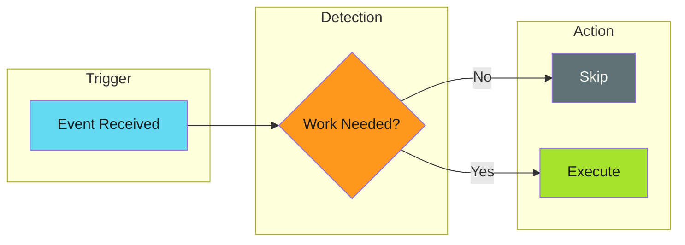

# Work Avoidance

## When to Use This Skill

Work avoidance detects when an operation isn't needed and skips it entirely. Unlike [idempotency](../idempotency/index.md) (which makes reruns safe), work avoidance prevents the run from happening at all.

---

## Implementation

See the full implementation guide in the source documentation.

## Examples

See [examples.md](examples.md) for code examples.

## References

- [Source Documentation](https://adaptive-enforcement-lab.com/patterns/efficiency/)
- [AEL Patterns](https://adaptive-enforcement-lab.com/patterns/)
