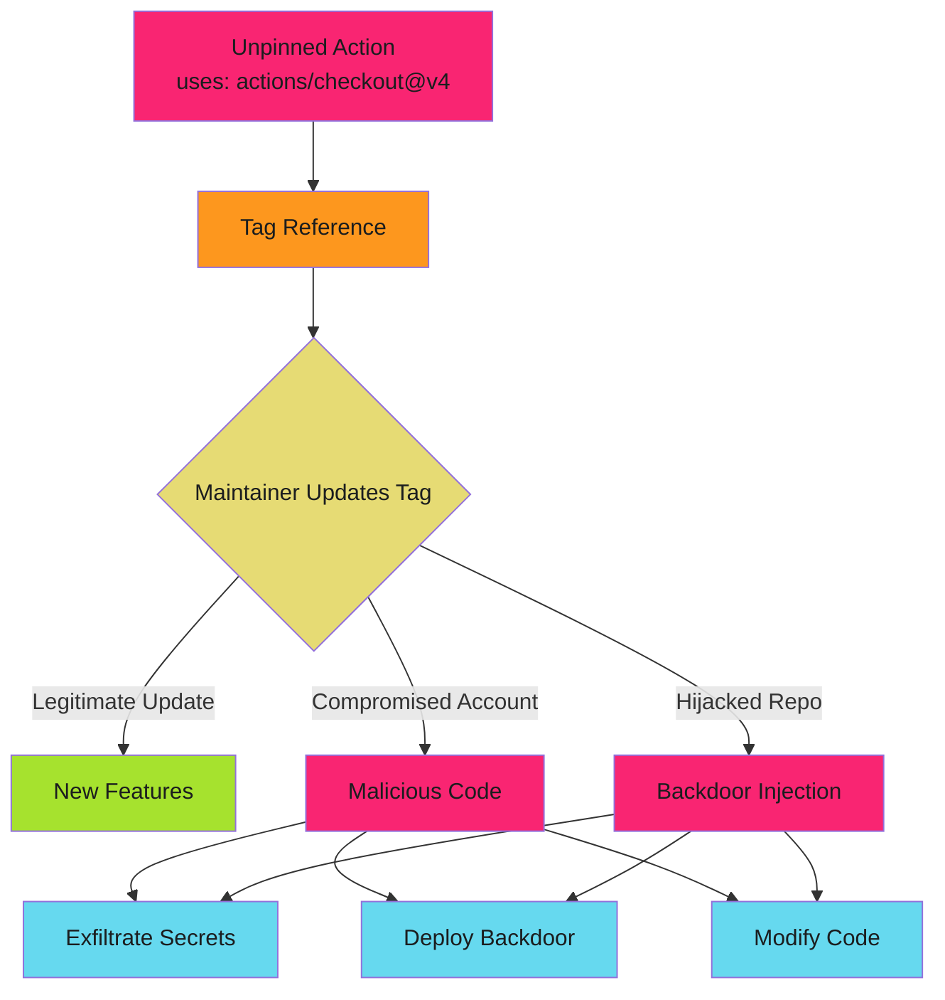

# Action Pinning Overview

## When to Use This Skill

Lock down your GitHub Actions supply chain. Unpinned actions are the fastest route to a compromised CI/CD pipeline.

> **The Risk**
>
>
> Every action in your workflow executes with access to your repository secrets, cloud credentials, and deployment permissions. A single compromised action can exfiltrate everything.
>

## Why Action Pinning Matters

GitHub Actions workflows pull third-party code directly into your CI/CD pipeline. Without pinning, you're trusting that:

1. The action maintainer won't turn malicious
2. Their account won't be compromised
3. Their repository won't be hijacked
4. Tag references won't be moved to malicious commits

**Reality**: All four scenarios have occurred in production environments.

## The Attack Surface



## Tag References vs SHA Pinning

### Tag-Based References (Unsafe)

```yaml
- uses: actions/checkout@v4
- uses: actions/setup-node@v3
```

**The Problem**: Tags are mutable. Maintainers can update `v4` to point to any commit. You have no guarantee the code hasn't changed since you tested it.

**Attack Vector**: Compromised maintainer moves tag to malicious commit. Every workflow using that tag now executes attacker code.

### SHA Pinning (Secure)

```yaml
# actions/checkout v4.1.1
- uses: actions/checkout@b4ffde65f46336ab88eb53be808477a3936bae11

# actions/setup-node v3.8.1
- uses: actions/setup-node@5e21ff4d9bc1a8cf6de233a3057d20ec6b3fb69d
```

**The Defense**: SHA-256 commit hashes are immutable. The code at that hash cannot change. You're pinning to exact, verified code.

**Comment Strategy**: Include the semantic version in a comment so humans know what SHA represents.

## Tag vs SHA Comparison

| Aspect | Tag Reference | SHA Pinning |
| ------ | ------------- | ----------- |
| **Mutability** | Tag can move to any commit | SHA is immutable |
| **Supply Chain Risk** | High - trust maintainer forever | Low - trust specific commit |
| **Update Visibility** | Silent updates | Explicit updates via PR |
| **Compromise Detection** | Difficult - looks like normal update | Clear - SHA change triggers review |
| **Dependabot Support** | Yes | Yes |
| **Human Readability** | Good (`v4`) | Poor (`b4ffde6...`) without comments |
| **Security Posture** | Vulnerable | Hardened |

## Real-World Attack Scenarios

### Scenario 1: Compromised Maintainer Account

**Timeline**:

- T+0: Attacker compromises maintainer's GitHub account via credential stuffing
- T+1h: Attacker updates `v3` tag to point to backdoored commit
- T+2h: Thousands of workflows worldwide execute malicious code
- T+6h: Secrets exfiltrated to attacker-controlled servers
- T+24h: Breach discovered, tag reverted, damage done

**Impact**: Multi-organization breach. Secrets, credentials, and source code compromised across hundreds of repositories.

**Prevention**: SHA pinning. Workflows continue using verified commit. Dependabot flags the tag update for review.

### Scenario 2: Repository Takeover

**Timeline**:

- T+0: Popular action repository uses simple password, no 2FA
- T+1d: Attacker gains access, adds malicious code to next release
- T+2d: Users update to new version via tag reference
- T+3d: Backdoor establishes persistence in CI/CD pipelines
- T+7d: Attacker pivots to production deployments

**Impact**: Supply chain compromise affecting downstream users. Deployment credentials stolen, production systems compromised.

**Prevention**: SHA pinning with Dependabot review. Team reviews changelog and diff before approving SHA update.

### Scenario 3: Typosquatting with Tag Manipulation

**Timeline**:

- T+0: Attacker creates `actions/check0ut` (zero instead of 'o')
- T+1h: Developer makes typo in workflow file
- T+2h: Malicious action executes with repository secrets
- T+3h: AWS credentials exfiltrated
- T+4h: Attacker deploys crypto miners to organization's cloud account

**Impact**: Developer typo leads to cloud account compromise. Thousands in cloud costs, potential data breach.

**Prevention**: SHA pinning forces explicit review. Full action path visible in security review. Allowlisting blocks unknown actions.

## Supply Chain Risk Framework

### Trust Tiers

#### Tier 1: GitHub-Maintained Actions

- Examples: `actions/checkout`, `actions/setup-node`, `actions/upload-artifact`
- Risk: Low (GitHub's security team)
- Recommendation: SHA pin, but lower review priority

#### Tier 2: Verified Publishers

- Examples: `aws-actions/*`, `azure/*`, `google-github-actions/*`
- Risk: Medium (corporate security teams)
- Recommendation: SHA pin, review on updates

#### Tier 3: Community Actions

- Examples: Individual maintainers, small teams
- Risk: High (unknown security posture)
- Recommendation: SHA pin, thorough source review, consider forking

#### Tier 4: Unknown/Unvetted

- Risk: Critical
- Recommendation: Block until reviewed, consider alternatives

## Attack Vector Deep Dive

### 1. Tag Mutation Attack

**Mechanism**: Attacker with write access moves tag to malicious commit.

```bash
# Attacker commands
git tag -d v3
git tag v3 <malicious-commit-sha>
git push --force --tags
```

**Result**: All workflows using `@v3` now execute malicious code. No PR, no review, no notification.

### 2. Dependency Confusion

**Mechanism**: Action imports malicious package via package manager inside action code.

**Example**:

```yaml
# Action looks safe
- uses: trusted-org/deploy-action@v2
```

But inside `trusted-org/deploy-action`:

```javascript
// action.js imports compromised package
const utils = require('internal-deploy-utils');  // Typosquatted package
```

**Result**: Even SHA-pinned action can be compromised if it pulls unpinned dependencies.

**Defense**: Review action source code, check action's own dependencies, use Dependabot for action repos.

### 3. Compromised GitHub Account

**Mechanism**: Attacker uses stolen credentials or session hijacking to access maintainer account.

**Attack Path**:

1. Phishing email targets maintainer
2. Credentials harvested
3. Attacker logs in (no 2FA required)
4. Malicious commit pushed
5. Tag updated
6. Backdoor deployed to thousands of workflows

**Result**: Widespread compromise across all users of the action.

**Defense**: SHA pinning breaks attack chain. Workflows don't auto-update to compromised version.

## Pinning Strategy

### Baseline Security Posture

```yaml
name: Secure CI
on: [push]

permissions:
  contents: read

jobs:
  test:
    runs-on: ubuntu-latest
    steps:
      # SHA-pinned actions with version comments
      - uses: actions/checkout@b4ffde65f46336ab88eb53be808477a3936bae11  # v4.1.1
      - uses: actions/setup-node@5e21ff4d9bc1a8cf6de233a3057d20ec6b3fb69d  # v3.8.1

      - name: Install dependencies
        run: npm ci

      - name: Run tests
        run: npm test
```

### Update Workflow with Dependabot

Dependabot monitors your workflow files and creates PRs for action updates:

```yaml
# .github/dependabot.yml
version: 2
updates:
  - package-ecosystem: "github-actions"
    directory: "/"
    schedule:
      interval: "weekly"
    labels:
      - "dependencies"
      - "github-actions"
```

**Process**:

1. Dependabot detects new action version
2. Creates PR updating SHA with version comment
3. Team reviews changelog and diff
4. Approve or reject update
5. Merge updates approved changes

## Exceptions and Trade-offs

### When SHA Pinning May Not Apply

**Internal Actions** (same organization):

```yaml
# Internal shared action
- uses: my-org/shared-workflows/.github/actions/deploy@main
```

**Consideration**: If you control the repository and trust your team, tag references acceptable. Still recommend SHA pinning for audit trail.

**Docker Container Actions**:

```yaml
# Action runs in container
- uses: docker://alpine:3.18
```

**Consideration**: Container images have their own pinning strategy (digest-based). Apply same principles:

```yaml
# Digest-pinned container
- uses: docker://alpine@sha256:abc123...
```

## Integration with Security Controls

### 1. Action Allowlisting

Organization-level policy restricts which actions can be used:

```text
Settings → Actions → General → Allow select actions and reusable workflows
```

Add verified actions to allowlist. Blocks unknown actions at workflow runtime.

### 2. Branch Protection

Require status checks for workflows that modify action pins:

- Enforce code review for `.github/workflows/*` changes
- Require security team approval for new actions
- Block force pushes to protected branches

### 3. Audit and Monitoring

Track action usage across organization:

- Audit log: Filter by `workflow_job`
- SIEM integration: Alert on new action patterns
- Periodic reviews: Quarterly action security audit

## Next Steps

Ready to implement SHA pinning? Continue with:

- **[SHA Pinning Patterns](sha-pinning.md)**: Complete implementation patterns with copy-paste examples
- **[Automation Scripts](automation.md)**: Detect unpinned actions, bulk update to SHAs, verify pins
- **[Dependabot Configuration](dependabot.md)**: Automated updates with security review workflow

## Quick Reference

| Risk | Mitigation | Effort |
| ---- | ---------- | ------ |
| **Tag mutation** | SHA pinning | Low |
| **Compromised maintainer** | SHA pinning + review | Medium |
| **Typosquatting** | Allowlisting | Medium |
| **Dependency confusion** | Source review | High |
| **Silent updates** | Dependabot + PR review | Low |

---

> **Start Today**
>
>
> Pin your most critical workflows first. Focus on workflows with:
>
> - Production deployment access
> - Cloud credential usage
> - Cross-repository permissions
>
> Use automation scripts to detect unpinned actions and generate SHA-pinned versions.


## When to Apply

### Scenario 1: Compromised Maintainer Account

**Timeline**:

- T+0: Attacker compromises maintainer's GitHub account via credential stuffing
- T+1h: Attacker updates `v3` tag to point to backdoored commit
- T+2h: Thousands of workflows worldwide execute malicious code
- T+6h: Secrets exfiltrated to attacker-controlled servers
- T+24h: Breach discovered, tag reverted, damage done

**Impact**: Multi-organization breach. Secrets, credentials, and source code compromised across hundreds of repositories.

**Prevention**: SHA pinning. Workflows continue using verified commit. Dependabot flags the tag update for review.

### Scenario 2: Repository Takeover

**Timeline**:

- T+0: Popular action repository uses simple password, no 2FA
- T+1d: Attacker gains access, adds malicious code to next release
- T+2d: Users update to new version via tag reference
- T+3d: Backdoor establishes persistence in CI/CD pipelines
- T+7d: Attacker pivots to production deployments

**Impact**: Supply chain compromise affecting downstream users. Deployment credentials stolen, production systems compromised.

**Prevention**: SHA pinning with Dependabot review. Team reviews changelog and diff before approving SHA update.

### Scenario 3: Typosquatting with Tag Manipulation

**Timeline**:

- T+0: Attacker creates `actions/check0ut` (zero instead of 'o')
- T+1h: Developer makes typo in workflow file
- T+2h: Malicious action executes with repository secrets
- T+3h: AWS credentials exfiltrated
- T+4h: Attacker deploys crypto miners to organization's cloud account

**Impact**: Developer typo leads to cloud account compromise. Thousands in cloud costs, potential data breach.

**Prevention**: SHA pinning forces explicit review. Full action path visible in security review. Allowlisting blocks unknown actions.


## Implementation

See the full implementation guide in the [source documentation](https://adaptive-enforcement-lab.com/secure/github-actions-security/).


## Comparison

### Tag-Based References (Unsafe)

```yaml
- uses: actions/checkout@v4
- uses: actions/setup-node@v3
```

**The Problem**: Tags are mutable. Maintainers can update `v4` to point to any commit. You have no guarantee the code hasn't changed since you tested it.

**Attack Vector**: Compromised maintainer moves tag to malicious commit. Every workflow using that tag now executes attacker code.

### SHA Pinning (Secure)

```yaml
# actions/checkout v4.1.1
- uses: actions/checkout@b4ffde65f46336ab88eb53be808477a3936bae11

# actions/setup-node v3.8.1
- uses: actions/setup-node@5e21ff4d9bc1a8cf6de233a3057d20ec6b3fb69d
```

**The Defense**: SHA-256 commit hashes are immutable. The code at that hash cannot change. You're pinning to exact, verified code.

**Comment Strategy**: Include the semantic version in a comment so humans know what SHA represents.


## Examples

See [examples.md](examples.md) for code examples.


## Full Reference

See [reference.md](reference.md) for complete documentation.
## References

- [Source Documentation](https://adaptive-enforcement-lab.com/secure/github-actions-security/)
- [AEL Secure](https://adaptive-enforcement-lab.com/secure/)
