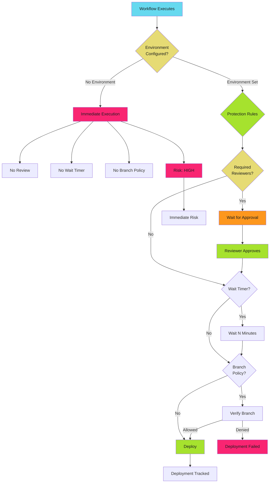

# Environment Protection Patterns

## When to Use This Skill

Environments add approval gates, wait timers, and deployment controls to GitHub Actions workflows. Production deployments should never execute without human review.

> **The Risk**
>
>
> Workflows without environment protection can deploy malicious code to production in seconds. A compromised PR or workflow modification can push backdoors, exfiltrate data, or take down services before security teams detect the breach.


## Implementation

See the full implementation guide in the [source documentation](https://adaptive-enforcement-lab.com/secure/github-actions-security/).


## Techniques


### Environment Security Model

GitHub Environments provide deployment protection through approval gates, wait timers, branch policies, and deployment tracking.




### Environment Protection Rules

Environments support four protection mechanisms.

### Required Reviewers

Require manual approval from designated reviewers before deployment.

**Configuration**: Settings → Environments → Environment name → Required reviewers

**Reviewers**: Up to 6 users or teams

**Use Case**: Production deployments, security-sensitive operations

**Example**:

```yaml
name: Production Deploy
on:
  push:
    branches: [main]

permissions:
  contents: read
  id-token: write

jobs:
  deploy:
    runs-on: ubuntu-latest
    environment: production
    steps:
      - uses: actions/checkout@b4ffde65f46336ab88eb53be808477a3936bae11  # v4.1.1

      - uses: google-github-actions/auth@55bd3a7c6e2ae7cf1877fd1ccb9d54c0503c457c  # v2.1.2
        with:
          workload_identity_provider: ${{ secrets.WIF_PROVIDER }}
          service_account: ${{ secrets.WIF_SERVICE_ACCOUNT }}

      - name: Deploy to production
        run: ./scripts/deploy.sh production
```

**Protection Behavior**:

1. Workflow reaches environment job
2. Workflow pauses, pending approval
3. GitHub notifies required reviewers
4. At least one reviewer must approve
5. Workflow resumes after approval

### Wait Timer

Delay deployment execution for a fixed period. Gives security teams time to detect malicious deployments.

**Configuration**: Settings → Environments → Environment name → Wait timer

**Duration**: 0-43200 minutes (up to 30 days)

**Use Case**: Detect malicious commits before production deployment, compliance requirements

**Example Production Pattern**:

```yaml
name: Production Deploy with Wait Timer
on:
  push:
    branches: [main]

permissions:
  contents: read
  id-token: write

jobs:
  deploy:
    runs-on: ubuntu-latest
    environment:
      name: production
      url: https://app.example.com
    steps:
      - uses: actions/checkout@b4ffde65f46336ab88eb53be808477a3936bae11  # v4.1.1

      - uses: google-github-actions/auth@55bd3a7c6e2ae7cf1877fd1ccb9d54c0503c457c  # v2.1.2
        with:
          workload_identity_provider: ${{ secrets.WIF_PROVIDER }}
          service_account: ${{ secrets.WIF_SERVICE_ACCOUNT }}

      - run: ./scripts/deploy.sh production
```

Configure wait timer in Settings → Environments → production → Wait timer: 15 minutes.

**Recommended Wait Times**:

| Environment | Wait Time | Rationale |
| ----------- | --------- | --------- |
| Development | 0 minutes | Fast feedback |
| Staging | 5 minutes | Brief security scan window |
| Production | 15-30 minutes | Security team review, monitoring alerts |
| Critical Infrastructure | 60 minutes | Extended review, compliance validation |

### Deployment Branch Policy

Restrict deployments to specific branches or tags.

**Configuration**: Settings → Environments → Environment name → Deployment branches

**Policy Types**:

1. **Protected branches only**: Only branches with protection rules
2. **Selected branches and tags**: Explicit allow-list with wildcard support
3. **All branches**: No restrictions (dangerous for production)

**Example Branch Policy Configuration**:

**Pattern**: `main`, `release/*`, `hotfix/*`

**Use Case**: Production environment only deploys from main, release, or hotfix branches

**Workflow**:

```yaml
name: Multi-Environment Deploy
on:
  push:
    branches: [main, 'release/**', 'hotfix/**']

permissions:
  contents: read
  id-token: write

jobs:
  deploy-production:
    runs-on: ubuntu-latest
    environment: production
    if: github.ref == 'refs/heads/main'
    steps:
      - uses: actions/checkout@b4ffde65f46336ab88eb53be808477a3936bae11  # v4.1.1
      - uses: google-github-actions/auth@55bd3a7c6e2ae7cf1877fd1ccb9d54c0503c457c  # v2.1.2
        with:
          workload_identity_provider: ${{ secrets.WIF_PROVIDER }}
          service_account: ${{ secrets.WIF_SERVICE_ACCOUNT }}
      - run: ./scripts/deploy.sh production

  deploy-staging:
    runs-on: ubuntu-latest
    environment: staging
    if: startsWith(github.ref, 'refs/heads/release/')
    steps:
      - uses: actions/checkout@b4ffde65f46336ab88eb53be808477a3936bae11  # v4.1.1
      - uses: google-github-actions/auth@55bd3a7c6e2ae7cf1877fd1ccb9d54c0503c457c  # v2.1.2
        with:
          workload_identity_provider: ${{ secrets.WIF_PROVIDER }}
          service_account: ${{ secrets.WIF_SERVICE_ACCOUNT }}
      - run: ./scripts/deploy.sh staging
```

**Recommended Policies**:

| Environment | Policy | Branches/Tags |
| ----------- | ------ | ------------- |
| Development | All branches | Any branch |
| Staging | Selected branches | `main`, `release/*`, `develop` |
| Production | Protected branches only | `main` (with protection rules) |
| Hotfix | Selected branches | `main`, `hotfix/*` |

### Environment Secrets

Store deployment credentials scoped to specific environments.

**Configuration**: Settings → Environments → Environment name → Environment secrets

**Scope**: Only available to workflows using the environment

**Use Case**: Separate production and staging credentials, minimize secret exposure

**Example**:

```yaml
name: Multi-Environment Deploy
on:
  workflow_dispatch:
    inputs:
      environment:
        required: true
        type: choice
        options:
          - staging
          - production

permissions:
  contents: read
  id-token: write

jobs:
  deploy:
    runs-on: ubuntu-latest
    environment: ${{ github.event.inputs.environment }}
    steps:
      - uses: actions/checkout@b4ffde65f46336ab88eb53be808477a3936bae11  # v4.1.1

      - uses: google-github-actions/auth@55bd3a7c6e2ae7cf1877fd1ccb9d54c0503c457c  # v2.1.2
        with:
          workload_identity_provider: ${{ secrets.WIF_PROVIDER }}
          service_account: ${{ secrets.WIF_SERVICE_ACCOUNT }}

      - run: ./scripts/deploy.sh ${{ github.event.inputs.environment }}
```

Environment secrets `WIF_PROVIDER` and `WIF_SERVICE_ACCOUNT` are scoped to `staging` and `production` environments with different values.


### Deployment Gates

Combine protection rules for defense-in-depth.

### Pattern 1: Production Triple Gate

**Protection**: Required reviewers + Wait timer + Branch policy

**Configuration**:

- Required reviewers: 2 platform team members
- Wait timer: 15 minutes
- Deployment branches: Protected branches only (`main`)

**Workflow**:

```yaml
name: Production Triple Gate
on:
  push:
    branches: [main]

permissions:
  contents: read
  id-token: write

jobs:
  security-scan:
    runs-on: ubuntu-latest
    permissions:
      contents: read
      security-events: write
    steps:
      - uses: actions/checkout@b4ffde65f46336ab88eb53be808477a3936bae11  # v4.1.1
      - uses: aquasecurity/trivy-action@84384bd6e777ef152729993b8145ea352e9dd3ef  # 0.17.0
        with:
          scan-type: 'fs'
          format: 'sarif'
          output: 'trivy-results.sarif'
      - uses: github/codeql-action/upload-sarif@cdcdbb579706841c47f7063dda365e292e5cad7a  # v2.13.4
        with:
          sarif_file: 'trivy-results.sarif'

  deploy:
    runs-on: ubuntu-latest
    needs: security-scan
    environment:
      name: production
      url: https://app.example.com
    steps:
      - uses: actions/checkout@b4ffde65f46336ab88eb53be808477a3936bae11  # v4.1.1

      - uses: google-github-actions/auth@55bd3a7c6e2ae7cf1877fd1ccb9d54c0503c457c  # v2.1.2
        with:
          workload_identity_provider: ${{ secrets.WIF_PROVIDER }}
          service_account: ${{ secrets.WIF_SERVICE_ACCOUNT }}

      - name: Deploy to production
        run: ./scripts/deploy.sh production

      - name: Notify deployment
        if: always()
        run: |
          curl -X POST https://slack.com/api/chat.postMessage \
            -H "Authorization: Bearer ${{ secrets.SLACK_BOT_TOKEN }}" \
            -d "channel=deployments" \
            -d "text=Production deployment ${{ job.status }} for ${{ github.sha }}"
```

**Protection Flow**:

*See [reference.md](reference.md) for additional techniques and detailed examples.*


## Examples

See [examples.md](examples.md) for code examples.


## Full Reference

See [reference.md](reference.md) for complete documentation.
## References

- [Source Documentation](https://adaptive-enforcement-lab.com/secure/github-actions-security/)
- [AEL Secure](https://adaptive-enforcement-lab.com/secure/)
