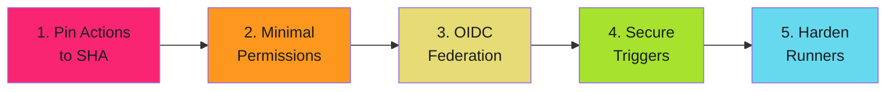

# GitHub Actions Security Patterns Hub - Examples


## Example 1: example-1.mermaid

```mermaid
flowchart TD
    A["GitHub Actions Workflow"] --> B["Action Supply Chain"]
    A --> C["GITHUB_TOKEN Permissions"]
    A --> D["Secrets & Credentials"]
    A --> E["Runner Environment"]
    A --> F["Workflow Triggers"]

    B --> B1["Unpinned actions"]
    B --> B2["Malicious updates"]
    B --> B3["Compromised publishers"]

    C --> C1["Over-privileged tokens"]
    C --> C2["Default write permissions"]
    C --> C3["Workflow-level scope"]

    D --> D1["Secret exposure in logs"]
    D --> D2["Secret sprawl"]
    D --> D3["Long-lived credentials"]

    E --> E1["Shared runner state"]
    E --> E2["Insufficient isolation"]
    E --> E3["Network access"]

    F --> F1["Fork PRs"]
    F --> F2["pull_request_target"]
    F --> F3["Untrusted input"]

    %% Ghostty Hardcore Theme
    style A fill:#66d9ef,color:#1b1d1e
    style B fill:#f92572,color:#1b1d1e
    style C fill:#f92572,color:#1b1d1e
    style D fill:#f92572,color:#1b1d1e
    style E fill:#f92572,color:#1b1d1e
    style F fill:#f92572,color:#1b1d1e
    style B1 fill:#fd971e,color:#1b1d1e
    style B2 fill:#fd971e,color:#1b1d1e
    style B3 fill:#fd971e,color:#1b1d1e
    style C1 fill:#fd971e,color:#1b1d1e
    style C2 fill:#fd971e,color:#1b1d1e
    style C3 fill:#fd971e,color:#1b1d1e
    style D1 fill:#fd971e,color:#1b1d1e
    style D2 fill:#fd971e,color:#1b1d1e
    style D3 fill:#fd971e,color:#1b1d1e
    style E1 fill:#fd971e,color:#1b1d1e
    style E2 fill:#fd971e,color:#1b1d1e
    style E3 fill:#fd971e,color:#1b1d1e
    style F1 fill:#fd971e,color:#1b1d1e
    style F2 fill:#fd971e,color:#1b1d1e
    style F3 fill:#fd971e,color:#1b1d1e
```





## Example 2: example-2.yaml


```yaml
name: Secure CI
on:
  pull_request:  # (1) Use pull_request, not pull_request_target for untrusted code

# (2) Explicit minimal permissions
permissions:
  contents: read
  pull-requests: read

jobs:
  test:
    runs-on: ubuntu-latest
    steps:
      # (3) Pin actions to SHA
      - uses: actions/checkout@b4ffde65f46336ab88eb53be808477a3936bae11  # v4.1.1

      # (4) Avoid secrets where possible - use OIDC
      - uses: aws-actions/configure-aws-credentials@010d0da01d0b5a38af31e9c3470dbfdabdecca3a  # v4.0.1
        with:
          role-to-assume: arn:aws:iam::123456789012:role/github-actions
          aws-region: us-east-1

      # (5) Validate inputs before use
      - name: Run tests
        run: |
          if [[ "${{ github.event.pull_request.title }}" =~ ^[a-zA-Z0-9\ \-]+$ ]]; then
            npm test
          else
            echo "Invalid PR title format"
            exit 1
          fi
```


## Example 3: example-3.mermaid





