# GitHub Actions Security Patterns Hub - Reference

This is the complete reference documentation extracted from the source.


# GitHub Actions Security Patterns Hub

Consolidated, authoritative resource for securing GitHub Actions workflows. From action pinning to runner hardening, we cover what vendor cheat sheets miss.

> **Why This Hub Exists**
>
>
> GitHub Actions security guidance is scattered across vendor cheat sheets from GitGuardian, StepSecurity, Salesforce, and Wiz. No single authoritative source exists. This hub consolidates production-tested patterns for DevSecOps teams.
>

## The GitHub Actions Attack Surface

GitHub Actions workflows introduce multiple attack vectors that require defense in depth.

```mermaid
flowchart TD
    A["GitHub Actions Workflow"] --> B["Action Supply Chain"]
    A --> C["GITHUB_TOKEN Permissions"]
    A --> D["Secrets & Credentials"]
    A --> E["Runner Environment"]
    A --> F["Workflow Triggers"]

    B --> B1["Unpinned actions"]
    B --> B2["Malicious updates"]
    B --> B3["Compromised publishers"]

    C --> C1["Over-privileged tokens"]
    C --> C2["Default write permissions"]
    C --> C3["Workflow-level scope"]

    D --> D1["Secret exposure in logs"]
    D --> D2["Secret sprawl"]
    D --> D3["Long-lived credentials"]

    E --> E1["Shared runner state"]
    E --> E2["Insufficient isolation"]
    E --> E3["Network access"]

    F --> F1["Fork PRs"]
    F --> F2["pull_request_target"]
    F --> F3["Untrusted input"]

    %% Ghostty Hardcore Theme
    style A fill:#66d9ef,color:#1b1d1e
    style B fill:#f92572,color:#1b1d1e
    style C fill:#f92572,color:#1b1d1e
    style D fill:#f92572,color:#1b1d1e
    style E fill:#f92572,color:#1b1d1e
    style F fill:#f92572,color:#1b1d1e
    style B1 fill:#fd971e,color:#1b1d1e
    style B2 fill:#fd971e,color:#1b1d1e
    style B3 fill:#fd971e,color:#1b1d1e
    style C1 fill:#fd971e,color:#1b1d1e
    style C2 fill:#fd971e,color:#1b1d1e
    style C3 fill:#fd971e,color:#1b1d1e
    style D1 fill:#fd971e,color:#1b1d1e
    style D2 fill:#fd971e,color:#1b1d1e
    style D3 fill:#fd971e,color:#1b1d1e
    style E1 fill:#fd971e,color:#1b1d1e
    style E2 fill:#fd971e,color:#1b1d1e
    style E3 fill:#fd971e,color:#1b1d1e
    style F1 fill:#fd971e,color:#1b1d1e
    style F2 fill:#fd971e,color:#1b1d1e
    style F3 fill:#fd971e,color:#1b1d1e

```



## Threat Landscape Summary

### Supply Chain Attacks

**Attack Vector**: Compromised or malicious actions execute arbitrary code in your CI/CD pipeline.

**Real Risk**: Actions run with repository secrets, cloud credentials, and deployment access. A single compromised action can exfiltrate secrets, modify code, or deploy backdoors.

**Defense**: SHA pinning, Dependabot automation, allowlisting.

### Token Over-Privilege

**Attack Vector**: GITHUB_TOKEN with excessive permissions enables lateral movement across repositories.

**Real Risk**: Default `permissions: write-all` grants more access than 95% of workflows need. A script injection can create malicious releases, modify workflows, or compromise other repositories.

**Defense**: Explicit minimal permissions, job-level scoping, read-only defaults.

### Secret Exposure

**Attack Vector**: Secrets logged to console, committed to repositories, or exfiltrated through network calls.

**Real Risk**: GitHub masks secrets in logs, but encoding tricks bypass protection. Third-party actions may intentionally or accidentally leak credentials.

**Defense**: OIDC federation, secret scanning with push protection, minimal secret scope.

### Runner Compromise

**Attack Vector**: Self-hosted runners with insufficient isolation allow persistent access.

**Real Risk**: Shared runners can leak state between jobs. Public repository workflows on self-hosted runners execute untrusted code with internal network access.

**Defense**: Ephemeral runners, network isolation, private repository restrictions.

### Workflow Injection

**Attack Vector**: Untrusted input from PR titles, issue bodies, or commit messages injected into shell commands.

**Real Risk**: `pull_request_target` and `workflow_run` execute in privileged context. Attackers control input that becomes code execution.

**Defense**: Input validation, expression injection prevention, safe trigger patterns.

## Security Patterns Roadmap

### 1. Action Pinning

Lock down the supply chain. Pin actions to immutable SHAs, track versions with comments, automate updates with Dependabot.

**Coverage**:

- SHA pinning patterns and automation
- Version tracking strategies
- Dependabot configuration for actions
- Audit scripts for unpinned actions

[**Explore Action Pinning →**](action-pinning/index.md)

### 2. GITHUB_TOKEN Permissions

Minimize token scope. Apply least privilege at workflow and job level. Replace default `write-all` with explicit minimal permissions.

**Coverage**:

- Complete permissions matrix
- Workflow-specific permission templates
- Job-level permission scoping
- Troubleshooting permission errors

[**Explore Token Permissions →**](token-permissions/index.md)

### 3. Third-Party Action Risk Assessment

Evaluate before you adopt. Structured framework for assessing action security, maintenance, and trust level.

**Coverage**:

- Risk assessment checklist
- Trust tier classification
- Source code review patterns
- Organization allowlisting

[**Explore Action Risk Assessment →**](third-party-actions/index.md)

### 4. Secret Management

Eliminate long-lived credentials. Use OIDC federation for cloud access, implement secret rotation, enable scanning with push protection.

**Coverage**:

- OIDC federation for AWS, GCP, Azure
- Secret rotation automation
- Secret scanning configuration
- Incident response for leaked secrets

[**Explore Secret Management →**](secrets/secrets-management/index.md)

### 5. Self-Hosted Runner Security

Harden runners for production. Implement ephemeral patterns, network isolation, and runner group restrictions.

**Coverage**:

- Runner hardening checklist
- Ephemeral runner patterns (containers, VMs, ARC)
- Runner group management
- Network and access controls

[**Explore Runner Security →**](runners/index.md)

### 6. Workflow Security Patterns

Secure triggers and execution context. Understand `pull_request_target` risks, implement environment protection, validate inputs.

**Coverage**:

- Secure trigger patterns (`pull_request` vs `pull_request_target`)
- Environment protection rules
- Reusable workflow security
- Input validation patterns

[**Explore Workflow Patterns →**](workflows/triggers/index.md)

### 7. Complete Examples

Production-ready workflows demonstrating all security patterns. Copy-paste templates with inline security annotations.

**Coverage**:

- Hardened CI workflow
- Secure release workflow with SLSA provenance
- Deployment workflow with OIDC and approvals
- Security scanning workflow

[**Explore Examples →**](examples/ci-workflow/index.md)

## Quick Start

### Secure a Workflow in 5 Steps

```yaml
name: Secure CI
on:
  pull_request:  # (1) Use pull_request, not pull_request_target for untrusted code

# (2) Explicit minimal permissions
permissions:
  contents: read
  pull-requests: read

jobs:
  test:
    runs-on: ubuntu-latest
    steps:
      # (3) Pin actions to SHA
      - uses: actions/checkout@b4ffde65f46336ab88eb53be808477a3936bae11  # v4.1.1

      # (4) Avoid secrets where possible - use OIDC
      - uses: aws-actions/configure-aws-credentials@010d0da01d0b5a38af31e9c3470dbfdabdecca3a  # v4.0.1
        with:
          role-to-assume: arn:aws:iam::123456789012:role/github-actions
          aws-region: us-east-1

      # (5) Validate inputs before use
      - name: Run tests
        run: |
          if [[ "${{ github.event.pull_request.title }}" =~ ^[a-zA-Z0-9\ \-]+$ ]]; then
            npm test
          else
            echo "Invalid PR title format"
            exit 1
          fi
```

### Priority Order for Hardening


**Rationale**:

1. **Action pinning** prevents supply chain attacks with minimal workflow changes
2. **Minimal permissions** limits blast radius of any successful attack
3. **OIDC federation** eliminates long-lived secrets in most workflows
4. **Secure triggers** prevents fork-based attacks on public repositories
5. **Runner hardening** protects against persistent access and lateral movement

## Why Not Just Read GitHub Docs?

GitHub's official documentation covers individual security features. It does not provide:

- **Decision frameworks**: Which pattern for which scenario
- **Copy-paste templates**: Production-ready configurations
- **Automation scripts**: Audit and enforcement tooling
- **Real-world context**: Why each pattern matters in practice
- **Integration patterns**: How to combine multiple security controls

Vendor cheat sheets (GitGuardian, StepSecurity, Salesforce, Wiz) each cover fragments. This hub consolidates all patterns with operational context.

## Integration with Enforcement

Security patterns are only effective when enforced. See [Enforce](../../enforce/index.md) for:

- Branch protection requiring security checks
- Pre-commit hooks validating workflow syntax
- Policy-as-code enforcing action allowlists
- Status checks blocking insecure patterns

## Related Content

- **[GitHub Apps](../github-apps/index.md)**: Secure authentication for cross-repository automation
- **[Enforce](../../enforce/index.md)**: Make security patterns mandatory through automation
- **[GitHub Actions Integration Patterns](../../patterns/github-actions/actions-integration/index.md)**: Implementation patterns for GitHub Apps with Actions workflows
- **[File Distribution Use Case](../../patterns/github-actions/use-cases/file-distribution/index.md)**: Cross-repository file distribution automation pattern

## Contributing

Found a security pattern we missed? See gaps in coverage? [Contribute on GitHub](https://github.com/adaptive-enforcement-lab/adaptive-enforcement-lab-com).

## Quick Reference

| Pattern | Risk Mitigated | Effort | Impact |
| ------- | -------------- | ------ | ------ |
| **SHA Pinning** | Supply chain attacks | Low | High |
| **Minimal Permissions** | Token over-privilege | Low | High |
| **OIDC Federation** | Secret exposure | Medium | High |
| **Secure Triggers** | Fork-based attacks | Low | Medium |
| **Ephemeral Runners** | Runner persistence | High | Medium |
| **Input Validation** | Injection attacks | Medium | High |
| **Environment Protection** | Unauthorized deployment | Low | Medium |
| **Action Allowlisting** | Malicious actions | Medium | High |

---

> **Start with High Impact, Low Effort**
>
>
> Implement SHA pinning and minimal permissions first. Both require minimal workflow changes and dramatically reduce risk.
>
