# GKE Security Hardening Guide - Examples


## Example 1: example-1.mermaid

```mermaid
graph TB
    subgraph "Control Plane (Private)"
        API[API Server]
        ETCD[etcd]
        SCH[Scheduler]
    end

    subgraph "Data Plane (VPC-Native)"
        WI[Workload Identity]
        NP[Network Policies]
        PSS[Pod Security Standards]
    end

    subgraph "Security Layer"
        BA[Binary Authorization]
        CA[Cloud Armor]
        PSC[Private Service Connect]
    end

    API --> WI
    API --> NP
    API --> PSS
    BA --> API
    CA --> API
    PSC --> API

    %% Ghostty Hardcore Theme
    style API fill:#2D4263
    style WI fill:#4A7A8C
    style BA fill:#6B8E9F
    style CA fill:#6B8E9F
```





## Example 2: example-2.sh


```bash
# Clone infrastructure repository
git clone https://github.com/your-org/gke-infrastructure.git
cd gke-infrastructure

# Initialize Pulumi stack
pulumi stack init qac

# Configure cluster
pulumi config set gcp_project $PROJECT_ID
pulumi config set cluster_name qac-cluster
pulumi config set environment qac
pulumi config set team platform
pulumi config set cost_center engineering
pulumi config set admin_cidr_block 203.0.113.0/24

# Preview and deploy
pulumi preview
pulumi up

# Get cluster credentials
gcloud container clusters get-credentials qac-cluster \
  --region us-central1 \
  --project $PROJECT_ID
```


## Example 3: example-3.sh


```bash
#!/bin/bash
# Comprehensive security verification

CLUSTER="prod-cluster"
REGION="us-central1"

echo "=== Cluster Configuration ==="
gcloud container clusters describe $CLUSTER --region $REGION \
  --format="value(privateClusterConfig.enablePrivateNodes)" | grep -q "True" && echo "✓ Private cluster" || echo "✗ Public cluster"

gcloud container clusters describe $CLUSTER --region $REGION \
  --format="value(workloadIdentityConfig.workloadPool)" | grep -q "svc.id.goog" && echo "✓ Workload Identity enabled" || echo "✗ Workload Identity disabled"

gcloud container clusters describe $CLUSTER --region $REGION \
  --format="value(databaseEncryption.state)" | grep -q "ENCRYPTED" && echo "✓ Database encryption enabled" || echo "✗ Database encryption disabled"

echo ""
echo "=== Network Configuration ==="
gcloud container clusters describe $CLUSTER --region $REGION \
  --format="value(networkingConfig.useIpAliases)" | grep -q "True" && echo "✓ VPC-native networking" || echo "✗ Routes-based networking"

gcloud container clusters describe $CLUSTER --region $REGION \
  --format="value(networkPolicy.enabled)" | grep -q "True" && echo "✓ Network policies enabled" || echo "✗ Network policies disabled"

echo ""
echo "=== Pod Security ==="
kubectl get ns -o jsonpath='{range .items[*]}{.metadata.name}{"\t"}{.metadata.labels.pod-security\.kubernetes\.io/enforce}{"\n"}{end}' | column -t

echo ""
echo "=== IAM Configuration ==="
gcloud iam service-accounts list --format="table(email,displayName)"

echo ""
echo "=== Audit Logging ==="
gcloud logging sinks list --filter="destination:*storage*" --format="table(name,destination)"
```


## Example 4: example-4.yaml


```yaml
# Pulumi.qac.yaml
environment          = "qac"
kubernetes_version   = "1.28"
machine_type         = "e2-medium"
min_node_count       = 1
max_node_count       = 3
enable_monitoring    = true
pod_security_standard = "baseline"
```


## Example 5: example-5.yaml


```yaml
# Pulumi.dev.yaml
environment          = "dev"
kubernetes_version   = "1.28"
machine_type         = "e2-standard-2"
min_node_count       = 1
max_node_count       = 5
enable_monitoring    = true
pod_security_standard = "baseline"
```


## Example 6: example-6.yaml


```yaml
# Pulumi.stg.yaml
environment          = "stg"
kubernetes_version   = "1.28"
machine_type         = "e2-standard-4"
min_node_count       = 2
max_node_count       = 10
enable_monitoring    = true
pod_security_standard = "restricted"
```


## Example 7: example-7.yaml


```yaml
# Pulumi.prd.yaml
environment          = "prd"
kubernetes_version   = "1.28"
machine_type         = "e2-standard-4"
min_node_count       = 3
max_node_count       = 20
enable_monitoring    = true
pod_security_standard = "restricted"
enable_binary_auth   = true
enable_cloud_armor   = true
```


