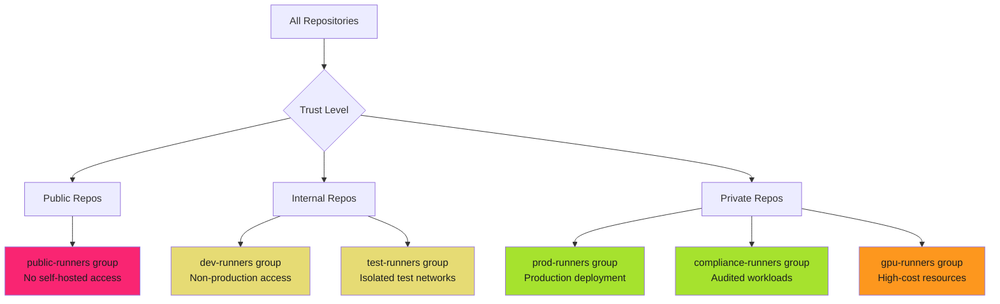

# Runner Group Management

## When to Use This Skill

Runner groups are security boundaries. Organize by trust level. Restrict by default. Enforce with workflow controls.

> **The Risk**
>
>
> Without runner groups, all self-hosted runners are available to all repositories. One compromised repository means access to production runners with elevated permissions. Malicious workflows can target high-value runners for lateral movement.

## Implementation

See the full implementation guide in the [source documentation](https://adaptive-enforcement-lab.com/secure/github-actions-security/).

## Techniques

### Runner Group Organization Strategies

Organize runners by security requirements, compliance needs, and operational constraints.

### Strategy 1: Trust-Based Organization

Organize by repository trust level and workflow sensitivity.

| Group Name | Trust Level | Repository Access | Network Scope | Credentials | Use Case |
| ---------- | ----------- | ----------------- | ------------- | ----------- | -------- |
| **public-runners** | Untrusted | Public repos only | Internet-only | None | Never use self-hosted for public repos |
| **dev-runners** | Low | Development repos | Isolated dev network | Development service accounts | Feature development, testing |
| **staging-runners** | Medium | Staging repos | Staging network | Staging credentials | Pre-production validation |
| **prod-runners** | High | Production repos | Production network | Production OIDC | Production deployments |
| **compliance-runners** | Highest | Compliance-approved repos | Audited networks | Minimal credentials | HIPAA, PCI-DSS, SOC2 workloads |

**Best Practice**: Never allow self-hosted runners for public repositories. External contributors can submit malicious workflows that execute on your infrastructure.

### Strategy 2: Workload-Based Organization

Organize by job type and resource requirements.

| Group Name | Job Type | Repository Access | Resource Profile | Cost Model | Use Case |
| ---------- | -------- | ----------------- | ---------------- | ---------- | -------- |
| **ci-runners** | CI/CD | All repos | 8 CPU, 16GB RAM | Standard | Build, test, lint |
| **deploy-runners** | Deployment | Release repos only | 4 CPU, 8GB RAM | Standard | Cloud deployments |
| **gpu-runners** | ML/AI | ML repos only | 16 CPU, 64GB RAM, 1 GPU | High-cost | Model training, inference |
| **build-runners** | Compilation | Build repos | 16 CPU, 32GB RAM | Standard | Large codebases, monorepo builds |
| **integration-runners** | Integration tests | Test repos | 8 CPU, 16GB RAM | Standard | Database integration, API tests |

**Best Practice**: Isolate high-cost runners (GPU, high-memory) to prevent accidental usage from unauthorized repositories. Monitor for cost anomalies.

### Strategy 3: Environment-Based Organization

Organize by deployment environment and protection rules.

| Group Name | Environment | Protection Rules | Approval Required | Network Access | Use Case |
| ---------- | ----------- | ---------------- | ----------------- | -------------- | -------- |
| **dev-runners** | Development | None | No | Dev VPC | Rapid iteration |
| **staging-runners** | Staging | Branch protection | No | Staging VPC | Pre-prod testing |
| **prod-runners** | Production | Environment protection | Yes | Prod VPC | Production deployments |
| **dr-runners** | Disaster Recovery | Manual trigger only | Yes | DR VPC | Failover scenarios |

**Best Practice**: Combine runner groups with GitHub environment protection rules. Require manual approval before jobs execute on production runners.

### Strategy 4: Compliance-Based Organization

Organize by regulatory requirements and audit needs.

| Group Name | Compliance Scope | Audit Logging | Data Classification | Network Isolation | Use Case |
| ---------- | ---------------- | ------------- | ------------------- | ----------------- | -------- |
| **pci-runners** | PCI-DSS | Full audit logs to SIEM | Cardholder data | Segmented PCI network | Payment processing |
| **hipaa-runners** | HIPAA | Encrypted logs, BAA | PHI | HIPAA-compliant VPC | Healthcare data |
| **fedramp-runners** | FedRAMP | CloudWatch + Splunk | CUI | FedRAMP-authorized VPC | Government workloads |
| **sox-runners** | SOX | Immutable logs | Financial data | Audited network | Financial reporting |
| **standard-runners** | None | Standard GitHub logs | Public/internal | Standard network | Non-regulated workloads |

**Best Practice**: Dedicated compliance runners with enhanced logging, immutable audit trails, and network segmentation per regulatory requirements.

*See [reference.md](reference.md) for additional techniques and detailed examples.*

## Examples

See [examples.md](examples.md) for code examples.

## Full Reference

See [reference.md](reference.md) for complete documentation.
## References

- [Source Documentation](https://adaptive-enforcement-lab.com/secure/github-actions-security/)
- [AEL Secure](https://adaptive-enforcement-lab.com/secure/)
