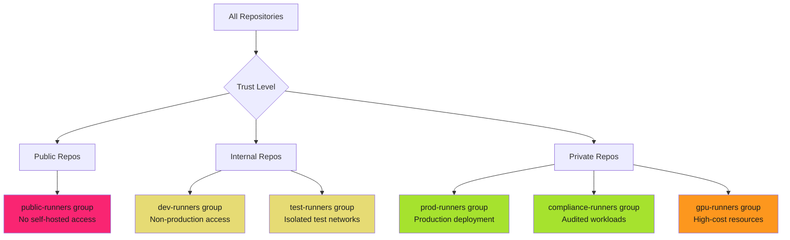

# Runner Group Management - Examples


## Example 1: example-1.mermaid





## Example 2: example-2.yaml


```yaml
# Runner group configuration (Settings UI)
Group: dev-runners
Access: All repositories
Workflow restrictions: None
```


## Example 3: example-3.yaml


```yaml
# Runner group configuration (Settings UI)
Group: prod-runners
Access: Selected repositories
Repositories:
  - org/production-api
  - org/production-web
  - org/production-infra
Workflow restrictions: Selected workflows
```


## Example 4: example-4.yaml


```yaml
# Runner group configuration (Settings UI)
Group: internal-runners
Access: Private repositories
Workflow restrictions: None
```


## Example 5: example-5.sh


```bash
#!/bin/bash
# Create runner group with repository restrictions

set -euo pipefail

ORG="your-organization"
GROUP_NAME="prod-runners"
RUNNER_GROUP_ID="123"
ALLOWED_REPOS=(
  "production-api"
  "production-web"
  "production-infra"
)

# Create runner group
gh api \
  --method POST \
  -H "Accept: application/vnd.github+json" \
  "/orgs/${ORG}/actions/runner-groups" \
  -f name="${GROUP_NAME}" \
  -f visibility="selected" \
  -F allows_public_repositories=false

# Add repositories to runner group
for repo in "${ALLOWED_REPOS[@]}"; do
  REPO_ID=$(gh api "/repos/${ORG}/${repo}" --jq '.id')

  gh api \
    --method PUT \
    -H "Accept: application/vnd.github+json" \
    "/orgs/${ORG}/actions/runner-groups/${RUNNER_GROUP_ID}/repositories/${REPO_ID}"

  echo "Added ${repo} to runner group ${GROUP_NAME}"
done
```


## Example 6: example-6.sh


```bash
#!/bin/bash
# Audit runner group repository access

set -euo pipefail

ORG="your-organization"

# List all runner groups
echo "==> Auditing runner group access for ${ORG}"

gh api "/orgs/${ORG}/actions/runner-groups" --paginate --jq '.runner_groups[]' | while read -r group; do
  GROUP_ID=$(echo "$group" | jq -r '.id')
  GROUP_NAME=$(echo "$group" | jq -r '.name')
  VISIBILITY=$(echo "$group" | jq -r '.visibility')

  echo ""
  echo "Runner Group: ${GROUP_NAME} (${VISIBILITY})"

  if [[ "$VISIBILITY" == "selected" ]]; then
    # List repositories with access
    gh api "/orgs/${ORG}/actions/runner-groups/${GROUP_ID}/repositories" --paginate \
      | jq -r '.repositories[].full_name' \
      | while read -r repo; do
        echo "  - ${repo}"
      done
  else
    echo "  - Access: All repositories"
  fi
done
```


## Example 7: example-7.yaml


```yaml
# Runner group configuration (Settings UI)
Group: prod-runners
Workflow access: Selected workflows
Allowed workflows:
  - org/production-api/.github/workflows/deploy-production.yml@refs/heads/main
  - org/production-web/.github/workflows/deploy-production.yml@refs/heads/main
  - org/production-infra/.github/workflows/terraform-apply.yml@refs/heads/main
```


## Example 8: example-8.yaml


```yaml
# prod-runners group configuration
Allowed workflows:
  - org/app-api/.github/workflows/deploy-prod.yml@refs/heads/main
  - org/app-web/.github/workflows/deploy-prod.yml@refs/heads/main
  - org/app-worker/.github/workflows/deploy-prod.yml@refs/heads/main
```


## Example 9: example-9.yaml


```yaml
# hipaa-runners group configuration
Allowed workflows:
  - org/patient-portal/.github/workflows/deploy-hipaa.yml@refs/heads/main
  - org/ehr-integration/.github/workflows/deploy-hipaa.yml@refs/heads/main
```


## Example 10: example-10.yaml


```yaml
# gpu-runners group configuration
Allowed workflows:
  - org/ml-training/.github/workflows/train-model.yml@refs/heads/main
  - org/ml-inference/.github/workflows/batch-inference.yml@refs/heads/main
```


## Example 11: example-11.sh


```bash

```


