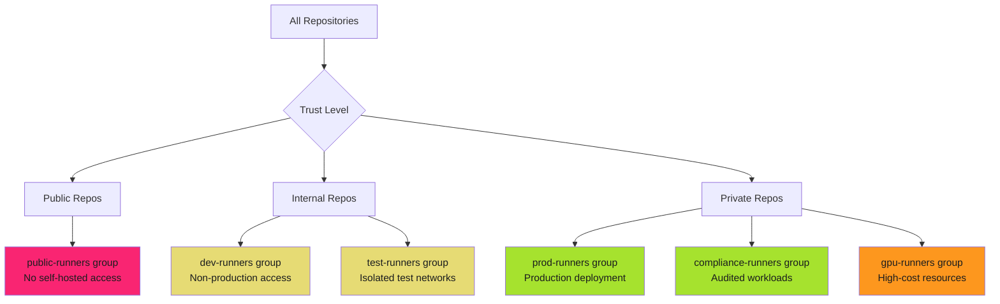

# Runner Group Management - Reference

This is the complete reference documentation extracted from the source.


# Runner Group Management

Runner groups are security boundaries. Organize by trust level. Restrict by default. Enforce with workflow controls.

> **The Risk**
>
>
> Without runner groups, all self-hosted runners are available to all repositories. One compromised repository means access to production runners with elevated permissions. Malicious workflows can target high-value runners for lateral movement.
>

## Why Runner Groups Matter

Self-hosted runners have different security profiles. Production runners have network access to production systems. Development runners are isolated. GPU runners cost money. Compliance runners must audit every job.

**Without groups**: All runners available to all repositories. No trust boundaries. No access control.

**With groups**: Security boundaries between runner types. Repository allow-lists. Workflow restrictions. Audit trails.

## Runner Group Organization Strategies

Organize runners by security requirements, compliance needs, and operational constraints.



### Strategy 1: Trust-Based Organization

Organize by repository trust level and workflow sensitivity.

| Group Name | Trust Level | Repository Access | Network Scope | Credentials | Use Case |
| ---------- | ----------- | ----------------- | ------------- | ----------- | -------- |
| **public-runners** | Untrusted | Public repos only | Internet-only | None | Never use self-hosted for public repos |
| **dev-runners** | Low | Development repos | Isolated dev network | Development service accounts | Feature development, testing |
| **staging-runners** | Medium | Staging repos | Staging network | Staging credentials | Pre-production validation |
| **prod-runners** | High | Production repos | Production network | Production OIDC | Production deployments |
| **compliance-runners** | Highest | Compliance-approved repos | Audited networks | Minimal credentials | HIPAA, PCI-DSS, SOC2 workloads |

**Best Practice**: Never allow self-hosted runners for public repositories. External contributors can submit malicious workflows that execute on your infrastructure.

### Strategy 2: Workload-Based Organization

Organize by job type and resource requirements.

| Group Name | Job Type | Repository Access | Resource Profile | Cost Model | Use Case |
| ---------- | -------- | ----------------- | ---------------- | ---------- | -------- |
| **ci-runners** | CI/CD | All repos | 8 CPU, 16GB RAM | Standard | Build, test, lint |
| **deploy-runners** | Deployment | Release repos only | 4 CPU, 8GB RAM | Standard | Cloud deployments |
| **gpu-runners** | ML/AI | ML repos only | 16 CPU, 64GB RAM, 1 GPU | High-cost | Model training, inference |
| **build-runners** | Compilation | Build repos | 16 CPU, 32GB RAM | Standard | Large codebases, monorepo builds |
| **integration-runners** | Integration tests | Test repos | 8 CPU, 16GB RAM | Standard | Database integration, API tests |

**Best Practice**: Isolate high-cost runners (GPU, high-memory) to prevent accidental usage from unauthorized repositories. Monitor for cost anomalies.

### Strategy 3: Environment-Based Organization

Organize by deployment environment and protection rules.

| Group Name | Environment | Protection Rules | Approval Required | Network Access | Use Case |
| ---------- | ----------- | ---------------- | ----------------- | -------------- | -------- |
| **dev-runners** | Development | None | No | Dev VPC | Rapid iteration |
| **staging-runners** | Staging | Branch protection | No | Staging VPC | Pre-prod testing |
| **prod-runners** | Production | Environment protection | Yes | Prod VPC | Production deployments |
| **dr-runners** | Disaster Recovery | Manual trigger only | Yes | DR VPC | Failover scenarios |

**Best Practice**: Combine runner groups with GitHub environment protection rules. Require manual approval before jobs execute on production runners.

### Strategy 4: Compliance-Based Organization

Organize by regulatory requirements and audit needs.

| Group Name | Compliance Scope | Audit Logging | Data Classification | Network Isolation | Use Case |
| ---------- | ---------------- | ------------- | ------------------- | ----------------- | -------- |
| **pci-runners** | PCI-DSS | Full audit logs to SIEM | Cardholder data | Segmented PCI network | Payment processing |
| **hipaa-runners** | HIPAA | Encrypted logs, BAA | PHI | HIPAA-compliant VPC | Healthcare data |
| **fedramp-runners** | FedRAMP | CloudWatch + Splunk | CUI | FedRAMP-authorized VPC | Government workloads |
| **sox-runners** | SOX | Immutable logs | Financial data | Audited network | Financial reporting |
| **standard-runners** | None | Standard GitHub logs | Public/internal | Standard network | Non-regulated workloads |

**Best Practice**: Dedicated compliance runners with enhanced logging, immutable audit trails, and network segmentation per regulatory requirements.

## Repository Access Restrictions

Control which repositories can use which runner groups.

### GitHub Enterprise Organization Settings

Runner groups are configured at the organization level with repository access controls.

**Configuration Path**: Organization Settings → Actions → Runner groups

#### Restriction Levels

##### Level 1: All Repositories (Least Secure)

All repositories in the organization can access the runner group.

**Use Case**: Development runners for non-sensitive workloads.

**Risk**: Compromised repository gains access to all runners in the group.

```yaml
# Runner group configuration (Settings UI)
Group: dev-runners
Access: All repositories
Workflow restrictions: None
```

##### Level 2: Selected Repositories (Recommended)

Explicit allow-list of repositories that can access the runner group.

**Use Case**: Production runners, compliance runners, high-cost runners.

**Risk**: Lower risk, but requires maintenance as new repositories are created.

```yaml
# Runner group configuration (Settings UI)
Group: prod-runners
Access: Selected repositories
Repositories:
  - org/production-api
  - org/production-web
  - org/production-infra
Workflow restrictions: Selected workflows
```

##### Level 3: Private Repositories Only

Only private repositories can access the runner group. Public repositories are blocked.

**Use Case**: Internal runners that should never execute public repository code.

**Risk**: Lower risk, but does not prevent compromised private repositories from accessing runners.

```yaml
# Runner group configuration (Settings UI)
Group: internal-runners
Access: Private repositories
Workflow restrictions: None
```

### API-Based Configuration

Automate runner group configuration using GitHub API.

```bash
#!/bin/bash
# Create runner group with repository restrictions

set -euo pipefail

ORG="your-organization"
GROUP_NAME="prod-runners"
RUNNER_GROUP_ID="123"
ALLOWED_REPOS=(
  "production-api"
  "production-web"
  "production-infra"
)

# Create runner group
gh api \
  --method POST \
  -H "Accept: application/vnd.github+json" \
  "/orgs/${ORG}/actions/runner-groups" \
  -f name="${GROUP_NAME}" \
  -f visibility="selected" \
  -F allows_public_repositories=false

# Add repositories to runner group
for repo in "${ALLOWED_REPOS[@]}"; do
  REPO_ID=$(gh api "/repos/${ORG}/${repo}" --jq '.id')

  gh api \
    --method PUT \
    -H "Accept: application/vnd.github+json" \
    "/orgs/${ORG}/actions/runner-groups/${RUNNER_GROUP_ID}/repositories/${REPO_ID}"

  echo "Added ${repo} to runner group ${GROUP_NAME}"
done
```

### Repository Access Verification

Audit which repositories can access which runner groups.

```bash
#!/bin/bash
# Audit runner group repository access

set -euo pipefail

ORG="your-organization"

# List all runner groups
echo "==> Auditing runner group access for ${ORG}"

gh api "/orgs/${ORG}/actions/runner-groups" --paginate --jq '.runner_groups[]' | while read -r group; do
  GROUP_ID=$(echo "$group" | jq -r '.id')
  GROUP_NAME=$(echo "$group" | jq -r '.name')
  VISIBILITY=$(echo "$group" | jq -r '.visibility')

  echo ""
  echo "Runner Group: ${GROUP_NAME} (${VISIBILITY})"

  if [[ "$VISIBILITY" == "selected" ]]; then
    # List repositories with access
    gh api "/orgs/${ORG}/actions/runner-groups/${GROUP_ID}/repositories" --paginate \
      | jq -r '.repositories[].full_name' \
      | while read -r repo; do
        echo "  - ${repo}"
      done
  else
    echo "  - Access: All repositories"
  fi
done
```

## Workflow Restrictions for Sensitive Runners

Control which workflows can execute on specific runner groups.

### Why Workflow Restrictions?

Repository access controls specify which repositories can use runners. Workflow restrictions specify which workflow files within those repositories can execute on those runners.

**Scenario**: Production runners should only execute deployment workflows, not arbitrary CI workflows.

**Without workflow restrictions**: Any workflow file in allowed repositories can use production runners.

**With workflow restrictions**: Only approved workflow files (e.g., `.github/workflows/deploy-production.yml`) can use production runners.

### Workflow Restriction Configuration

**Configuration Path**: Organization Settings → Actions → Runner groups → Workflow access

#### Option 1: No Restrictions (Default)

All workflows in allowed repositories can use the runner group.

**Use Case**: Development runners, non-sensitive workloads.

**Risk**: Any workflow file can target these runners.

#### Option 2: Selected Workflows (Recommended for Sensitive Runners)

Explicit allow-list of workflow files that can use the runner group.

**Use Case**: Production runners, compliance runners, high-value runners.

**Risk**: Requires maintenance as new deployment workflows are created.

```yaml
# Runner group configuration (Settings UI)
Group: prod-runners
Workflow access: Selected workflows
Allowed workflows:
  - org/production-api/.github/workflows/deploy-production.yml@refs/heads/main
  - org/production-web/.github/workflows/deploy-production.yml@refs/heads/main
  - org/production-infra/.github/workflows/terraform-apply.yml@refs/heads/main
```

**Format**: `{owner}/{repo}/.github/workflows/{workflow}.yml@{ref}`

**Best Practice**: Pin workflows to `refs/heads/main` to prevent malicious branches from bypassing restrictions.

### Workflow Restriction Patterns

#### Pattern 1: Production Deployment Workflows Only

Restrict production runners to deployment workflows verified by security team.

```yaml
# prod-runners group configuration
Allowed workflows:
  - org/app-api/.github/workflows/deploy-prod.yml@refs/heads/main
  - org/app-web/.github/workflows/deploy-prod.yml@refs/heads/main
  - org/app-worker/.github/workflows/deploy-prod.yml@refs/heads/main
```

**Enforcement**: CI workflows, test workflows, and feature branch workflows cannot use production runners.

#### Pattern 2: Compliance Workflows with Audit Trail

Restrict compliance runners to audited workflows with immutable logs.

```yaml
# hipaa-runners group configuration
Allowed workflows:
  - org/patient-portal/.github/workflows/deploy-hipaa.yml@refs/heads/main
  - org/ehr-integration/.github/workflows/deploy-hipaa.yml@refs/heads/main
```

**Additional Controls**:

- Workflows require manual approval (environment protection rules)
- All jobs logged to immutable SIEM
- Network isolated to HIPAA-compliant VPC

#### Pattern 3: Cost-Control for GPU Runners

Restrict expensive GPU runners to approved ML training workflows.

```yaml
# gpu-runners group configuration
Allowed workflows:
  - org/ml-training/.github/workflows/train-model.yml@refs/heads/main
  - org/ml-inference/.github/workflows/batch-inference.yml@refs/heads/main
```

**Monitoring**: Alert on unexpected GPU runner usage or cost spikes.

### API-Based Workflow Restrictions

Automate workflow restriction configuration using GitHub API.

```bash

