# Secret Scanning Integration - Examples


## Example 1: example-1.yaml


```yaml
# .github/workflows/verify-security.yml
# Workflow to enforce security features are enabled

name: Verify Security Configuration
on:
  schedule:
    - cron: '0 8 * * 1'  # Weekly Monday 8 AM
  workflow_dispatch:

permissions:
  contents: read

jobs:
  check-scanning:
    runs-on: ubuntu-latest
    steps:
      - name: Check secret scanning enabled
        uses: actions/github-script@60a0d83039c74a4aee543508d2ffcb1c3799cdea  # v7.0.1
        with:
          script: |
            const { data: repo } = await github.rest.repos.get({
              owner: context.repo.owner,
              repo: context.repo.repo
            });

            const required = [
              { setting: 'security_and_analysis.secret_scanning.status', name: 'Secret Scanning' },
              { setting: 'security_and_analysis.secret_scanning_push_protection.status', name: 'Push Protection' }
            ];

            for (const check of required) {
              const value = check.setting.split('.').reduce((o, k) => o?.[k], repo);
              if (value !== 'enabled') {
                core.setFailed(`${check.name} is not enabled (status: ${value})`);
              } else {
                core.info(`✓ ${check.name} enabled`);
              }
            }
```


## Example 2: example-2.sh


```bash
#!/bin/bash
# enable-secret-scanning.sh
# Enable secret scanning and push protection for all org repos

ORG="your-org"
TOKEN="${GITHUB_TOKEN}"

# Get all repositories in organization
repos=$(gh api \
  --paginate \
  "/orgs/${ORG}/repos" \
  --jq '.[].name')

for repo in $repos; do
  echo "Enabling secret scanning for ${ORG}/${repo}..."

  # Enable secret scanning
  gh api \
    --method PATCH \
    "/repos/${ORG}/${repo}" \
    -f security_and_analysis[secret_scanning][status]=enabled \
    -f security_and_analysis[secret_scanning_push_protection][status]=enabled

  echo "✓ ${repo} configured"
done
```


## Example 3: example-3.mermaid

```mermaid
sequenceDiagram

%% Ghostty Hardcore Theme
    participant Dev as Developer
    participant Git as Git Client
    participant GH as GitHub
    participant Scan as Secret Scanner

    Dev->>Git: git push origin main
    Git->>GH: Push commit
    GH->>Scan: Scan commit contents

    alt Secret Detected
        Scan-->>GH: Secret found (API key pattern)
        GH-->>Git: ❌ Push rejected
        Git-->>Dev: Error: secret detected<br/>Remove secret and retry
    else No Secret
        Scan-->>GH: No secrets found
        GH-->>Git: ✓ Push accepted
        Git-->>Dev: Push successful
    end
```





## Example 4: example-4.sh


```bash
# Developer pushes commit with secret
git push origin main
# > Error: secret detected in commit abc123
# > To bypass, visit: https://github.com/org/repo/security/bypass/abc123

# Developer bypasses with justification
# GitHub logs bypass event

# Security team reviews bypasses
gh api /repos/org/repo/secret-scanning/push-protection-bypasses
```


## Example 5: example-5.yaml


```yaml
# .github/workflows/monitor-bypasses.yml
# Alert security team when push protection bypassed

name: Monitor Push Protection Bypasses
on:
  schedule:
    - cron: '0 */4 * * *'  # Every 4 hours
  workflow_dispatch:

permissions:
  contents: read

jobs:
  check-bypasses:
    runs-on: ubuntu-latest
    steps:
      - name: Get recent bypasses
        uses: actions/github-script@60a0d83039c74a4aee543508d2ffcb1c3799cdea  # v7.0.1
        with:
          script: |
            const bypasses = await github.paginate(
              github.rest.secretScanning.listPushProtectionBypasses,
              {
                owner: context.repo.owner,
                repo: context.repo.repo
              }
            );

            const recent = bypasses.filter(b => {
              const created = new Date(b.created_at);
              const fourHoursAgo = new Date(Date.now() - 4 * 60 * 60 * 1000);
              return created > fourHoursAgo;
            });

            if (recent.length > 0) {
              core.warning(`${recent.length} push protection bypasses in last 4 hours`);
              for (const bypass of recent) {
                core.warning(`Bypass by ${bypass.pusher.login}: ${bypass.token_type}`);
              }
              // Trigger alert to security team (Slack, PagerDuty, etc.)
            }
```


## Example 6: example-6.regex


```regex
# Pattern components
(?i)                           # Case insensitive
\b                             # Word boundary
(internal_api_key|secret_key)  # Secret identifier
[\s:=]+                        # Separator
([a-f0-9]{64})                 # Secret value pattern
\b                             # Word boundary
```


## Example 7: example-7.sh


```bash
# Test custom pattern against sample file
echo "INTERNAL_API_KEY=a1b2c3d4e5f6..." > test-secret.txt

# GitHub CLI test (pattern must be created first)
gh secret-scanning list --repo org/repo

# Local regex test
grep -P '(?i)\b(internal_api_key\s*[:=]\s*)([a-f0-9]{64})\b' test-secret.txt
```


## Example 8: example-8.mermaid


