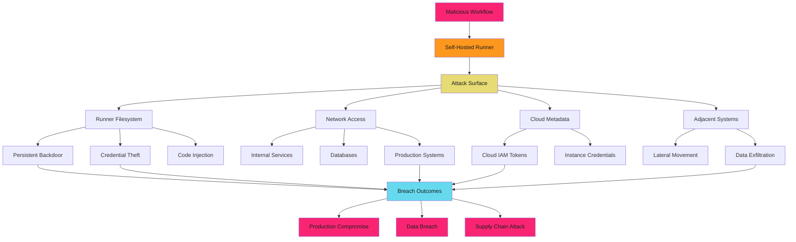

# Self-Hosted Runner Security Overview

## When to Use This Skill

Self-hosted runners put your infrastructure in the execution path. One compromised runner job means lateral movement into your network. Deploy defensively.

> **The Risk**
>

    Self-hosted runners execute untrusted code from pull requests and workflow files. Without proper isolation, a malicious workflow can escape the runner, persist in your network, exfiltrate data from adjacent systems, or pivot to production infrastructure.

## Why Self-Hosted Runners Create Risk

GitHub-hosted runners are ephemeral virtual machines that GitHub manages. Self-hosted runners are machines you operate. The security model changes completely:

1. **Persistent State**: Runners retain data between jobs unless explicitly cleaned
2. **Network Access**: Runners can reach your internal networks and cloud resources
3. **Credential Exposure**: Cloud metadata endpoints, local credentials, adjacent services
4. **Supply Chain Target**: Attackers can plant backdoors for future jobs to exploit
5. **Compliance Boundary**: Your infrastructure, your responsibility for security posture

**Reality**: Most teams deploy self-hosted runners without hardening, network isolation, or ephemeral job isolation.

## The Self-Hosted Runner Threat Model

## GitHub-Hosted vs Self-Hosted Comparison

Understanding the security trade-offs between GitHub-hosted and self-hosted runners.

| Aspect | GitHub-Hosted | Self-Hosted |
| ------ | ------------- | ----------- |
| **Isolation Model** | Ephemeral VM per job | Persistent runner (unless hardened) |
| **Network Scope** | Internet-only | Access to internal networks |
| **Credential Exposure** | GITHUB_TOKEN only | Cloud metadata, local creds, adjacent services |
| **State Persistence** | None (clean VM each job) | Filesystem persists between jobs |
| **Security Responsibility** | GitHub manages hardening | You manage OS, network, isolation |
| **Update Management** | GitHub maintains runner software | You maintain OS and runner software |
| **Compliance Boundary** | GitHub's infrastructure | Your infrastructure and policies |
| **Cost Model** | Free for public repos, usage-based for private | Infrastructure + management overhead |
| **Attack Surface** | Minimal (isolated, ephemeral) | High (persistent, networked, adjacent systems) |

**Key Takeaway**: GitHub-hosted runners are secure by default. Self-hosted runners require deliberate hardening.

## When to Use Self-Hosted Runners

Self-hosted runners introduce security risk. Only deploy them when specific requirements justify the operational burden.

### Valid Use Cases

#### 1. Internal Network Access Required

- Deployment to on-premises systems
- Integration testing against internal services
- Database migrations requiring direct network access
- Legacy infrastructure without public endpoints

Risk Mitigation: Network segmentation, ephemeral runners, minimal network scope

#### 2. Hardware Requirements Exceeding GitHub-Hosted Limits

- Large memory workloads (GitHub-hosted max: 64GB)
- GPU-accelerated builds or testing
- Specialized CPU architectures (ARM, RISC-V)
- High-throughput disk I/O workloads

Risk Mitigation: Dedicated runner groups, workload-specific hardening

#### 3. Compliance Requirements for Data Locality

- Regulated industries requiring data residency (HIPAA, GDPR, FedRAMP)
- Customer data that cannot leave specific geographic regions
- Air-gapped environments for classified workloads

Risk Mitigation: Dedicated compliance-hardened infrastructure, audit logging

#### 4. Software Licensing Constraints

- Commercial tools licensed to specific machines
- Enterprise software requiring license server access
- Proprietary build toolchains tied to infrastructure

Risk Mitigation: License-dedicated runners with minimal scope

### Invalid Use Cases (Use GitHub-Hosted Instead)

- **"Faster builds"**: GitHub-hosted runners are fast. Optimize your workflow first.
- **"Cost savings"**: Total cost of ownership (management overhead, security risk) typically exceeds GitHub-hosted costs
- **"Convenient access to cloud resources"**: Use OIDC federation to authenticate GitHub-hosted runners to cloud providers
- **"Need specific OS versions"**: GitHub provides Ubuntu, Windows, macOS with multiple versions
- **"Want persistent caches"**: Use `actions/cache` or artifact storage instead of filesystem persistence

## Self-Hosted Runner Deployment Models

Choose a deployment model based on security requirements and operational constraints.

### Model 1: Persistent Long-Lived Runners (Least Secure)

**Description**: Single runner process runs continuously on persistent VM or bare metal.

**Characteristics**:

- Filesystem state persists between jobs
- Network identity remains constant
- Runner software runs as long-lived service
- Same credentials available to all jobs

**Security Risk**: **High**

**When to Use**: Never for production workloads. Only for isolated internal testing.

**Attack Vectors**:

- Malicious job plants backdoor for future jobs to exploit
- Credential theft persists across job boundaries
- Network connections remain open for reconnaissance
- Filesystem poisoning affects subsequent builds

### Model 2: Ephemeral VM-Based Runners (Better)

**Description**: Fresh VM provisioned for each job, destroyed after completion.

**Characteristics**:

- Clean state for every job
- Isolated network identity per job
- VM metadata provides per-job credentials
- No cross-job contamination

**Security Risk**: **Medium**

**When to Use**: Internal workloads requiring network access with strong isolation.

**Attack Vectors**:

- Job can still access cloud metadata endpoints
- Network access to internal systems during job execution
- VM provisioning overhead increases attack window

**Technologies**: Packer for VM images, cloud-init for bootstrapping, Actions Runner Controller (ARC) for orchestration

### Model 3: Ephemeral Container-Based Runners (Best)

**Description**: Fresh container provisioned for each job, destroyed after completion.

**Characteristics**:

- Minimal attack surface (no systemd, limited binaries)
- Fast provisioning (seconds vs minutes for VMs)
- Network policies enforced at container level
- No access to cloud metadata without explicit configuration

**Security Risk**: **Low** (with proper hardening)

**When to Use**: Production workloads requiring self-hosted execution with strong security posture.

**Attack Vectors**:

- Container escape vulnerabilities (mitigate with gVisor, Kata Containers)
- Privileged container configurations (never use privileged mode)
- Shared kernel between containers (use VM-isolated containers for highest security)

**Technologies**: Podman for OCI containers, Kubernetes for orchestration, gVisor for container isolation

## Runner Security Threat Scenarios

### Scenario 1: Persistent Backdoor via Cron Job

**Timeline**:

- T+0: Malicious pull request workflow executes on persistent runner
- T+5m: Workflow installs reverse shell as cron job in runner's crontab
- T+1h: Workflow completes, PR closed as spam, no evidence in logs
- T+2h: Cron job executes, attacker gains interactive shell on runner
- T+4h: Attacker pivots to adjacent systems using runner's network access
- T+12h: Attacker exfiltrates database credentials from internal service
- T+24h: Production database breach detected, runner backdoor discovered

**Impact**: Full production compromise. Database exfiltration. Lateral movement across internal network.

**Prevention**: Ephemeral runners. Each job runs in fresh VM or container. No persistence between jobs.

### Scenario 2: Cloud Metadata Credential Theft

**Timeline**:

- T+0: Pull request workflow from external contributor executes on self-hosted runner
- T+1m: Workflow queries cloud metadata endpoint for IAM credentials
- T+2m: Workflow exfiltrates AWS/GCP credentials to attacker-controlled server
- T+10m: Workflow completes normally, no suspicious behavior in logs
- T+1h: Attacker uses stolen credentials to create admin user in cloud account
- T+6h: Attacker deploys cryptominer across cloud infrastructure
- T+24h: Unusual cloud billing triggers investigation, breach discovered

**Impact**: Cloud account compromise. Unauthorized resource consumption. Potential data access.

**Prevention**: Network policies blocking metadata endpoints. Instance Metadata Service v2 (IMDSv2) requiring token headers. Ephemeral runners with minimal IAM permissions.

### Scenario 3: Internal Network Reconnaissance

**Timeline**:

- T+0: External pull request workflow executes on runner with internal network access
- T+5m: Workflow performs port scan of internal network ranges
- T+15m: Workflow identifies database server on internal network
- T+20m: Workflow attempts default credentials against database
- T+25m: Workflow exfiltrates list of internal hostnames and open ports
- T+30m: Workflow completes, PR closed, reconnaissance data sent to attacker
- T+48h: Targeted phishing campaign against internal teams using reconnaissance data

**Impact**: Network topology disclosure. Internal service discovery. Reconnaissance for future attacks.

**Prevention**: Network segmentation. Runner networks isolated from production systems. Egress filtering. Deny-by-default firewall rules.

## Security Principles for Self-Hosted Runners

### Principle 1: Ephemeral Execution

**Never reuse runner state between jobs.**

Every job executes in a fresh environment (VM or container). Filesystem, network identity, and credentials start clean. Malicious job cannot plant persistence for future exploitation.

**Implementation**: Actions Runner Controller (ARC) with ephemeral mode, VM autoscaling groups with per-job lifecycle, container-based runners with destroy-on-completion.

### Principle 2: Network Isolation

**Runners should not have default access to production systems.**

Deploy runners in isolated network segments with explicit allow-lists for required internal services. Deny-by-default firewall rules. Egress filtering to prevent exfiltration.

**Implementation**: VPC/VNet segmentation, subnet-level network policies, deny-all egress with explicit allow rules for GitHub API and package registries.

### Principle 3: Minimal Credential Scope

**Runners receive only credentials required for specific jobs.**

No ambient credentials. No long-lived tokens. Use OIDC federation to mint short-lived credentials per job. Cloud IAM policies scoped to minimal required permissions.

**Implementation**: OIDC trust policies with subject claim validation, per-job temporary credentials, metadata endpoint blocking, runner-specific IAM roles.

### Principle 4: Audit Logging and Monitoring

**Every runner action is logged and monitored.**

Capture job execution logs, network connections, credential access, and system calls. Alert on anomalous behavior (unusual network destinations, metadata queries, privileged operations).

**Implementation**: Centralized log aggregation, CloudWatch/Stackdriver for cloud events, auditd for system calls, network flow logs, anomaly detection.

### Principle 5: Least Privilege Runner Groups

**Organize runners by trust level and scope.**

Separate runner groups for public repositories (untrusted) vs internal repositories (trusted). Different groups for production vs non-production workloads. Repository access restrictions per group.

**Implementation**: GitHub runner groups with repository allow-lists, workflow restrictions, required labels for sensitive runners.

## Quick Reference: Runner Security Checklist

Use this checklist when deploying or auditing self-hosted runners.

### Deployment Security

- [ ] Runners are ephemeral (fresh state per job)
- [ ] Network isolation from production systems
- [ ] Deny-by-default firewall rules
- [ ] Egress filtering configured
- [ ] No access to cloud metadata endpoints (or IMDSv2 enforced)
- [ ] Minimal IAM permissions scoped to runner needs
- [ ] OS hardening applied (CIS benchmarks)
- [ ] Runner software auto-updates enabled
- [ ] Dedicated runner groups for public vs private repos
- [ ] Repository access restrictions configured

### Runtime Security

- [ ] Jobs execute as non-root user
- [ ] No privileged container mode
- [ ] Filesystem isolation between jobs
- [ ] Temporary credentials only (no long-lived tokens)
- [ ] Secret injection via environment variables (not filesystem)
- [ ] Audit logging enabled and monitored
- [ ] Network connections logged and analyzed
- [ ] Anomaly detection configured for unusual behavior

### Operational Security

- [ ] Runner registration tokens rotated regularly
- [ ] Automated vulnerability scanning of runner images
- [ ] Incident response plan for runner compromise
- [ ] Regular review of runner access logs
- [ ] Decommission runners when no longer needed
- [ ] Monitor for unauthorized runner registration
- [ ] Alert on runner configuration changes
- [ ] Periodic penetration testing of runner infrastructure

## Next Steps

- **[Hardening Checklist](hardening/index.md)**: Comprehensive OS and runtime hardening steps
- **[Ephemeral Runners](ephemeral/index.md)**: Deployment patterns for VM and container-based ephemeral runners
- **[Runner Groups](groups/index.md)**: Organizing runners by trust level and security requirements

## Related Documentation

- [Secret Management Overview](../secrets/secrets-management/index.md): Securing credentials for runner access
- [OIDC Federation](../secrets/oidc/index.md): Secretless authentication from runners to cloud providers
- [Third-Party Action Risk Assessment](../third-party-actions/index.md): Evaluating actions that execute on runners
- [Workflow Triggers](../workflows/triggers/index.md): Understanding which events trigger runner execution

## Implementation

See the full implementation guide in the source documentation.

## References

- [Source Documentation](https://adaptive-enforcement-lab.com/secure/github-actions-security/)
- [AEL Secure](https://adaptive-enforcement-lab.com/secure/)
