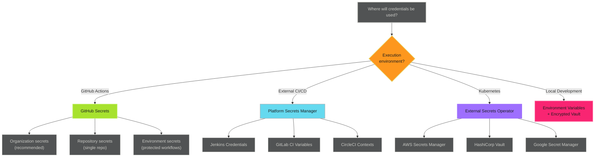

# Storing Credentials - Examples


## Example 1: example-1.mermaid





## Example 2: example-2.yaml


```yaml
jobs:
  deploy:
    environment: production
    steps:
      - name: Generate token
        uses: actions/create-github-app-token@v1
        with:
          app-id: ${{ secrets.CORE_APP_ID }}
          private-key: ${{ secrets.CORE_APP_PRIVATE_KEY }}
```


## Example 3: example-3.yaml


```yaml
- name: Generate token
  id: app-token
  uses: actions/create-github-app-token@v2
  with:
    app-id: ${{ secrets.CORE_APP_ID }}
    private-key: ${{ secrets.CORE_APP_PRIVATE_KEY }}

- name: Use token
  env:
    GITHUB_TOKEN: ${{ steps.app-token.outputs.token }}
  run: |
    gh api /repos/${{ github.repository }}/issues
```


## Example 4: example-4.yaml


```yaml
- name: Generate org-scoped token
  uses: actions/create-github-app-token@v2
  with:
    app-id: ${{ secrets.CORE_APP_ID }}
    private-key: ${{ secrets.CORE_APP_PRIVATE_KEY }}
    owner: my-organization
```


## Example 5: example-5.yaml


```yaml
- name: Generate multi-repo token
  uses: actions/create-github-app-token@v2
  with:
    app-id: ${{ secrets.CORE_APP_ID }}
    private-key: ${{ secrets.CORE_APP_PRIVATE_KEY }}
    repositories: |
      repo-one
      repo-two
      repo-three
```


