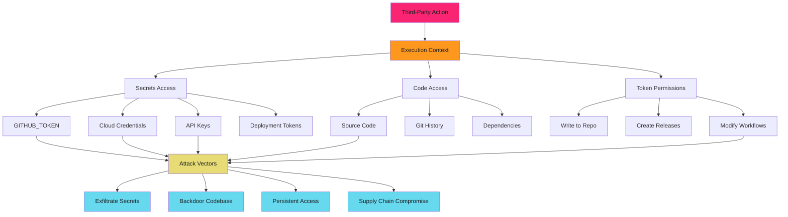
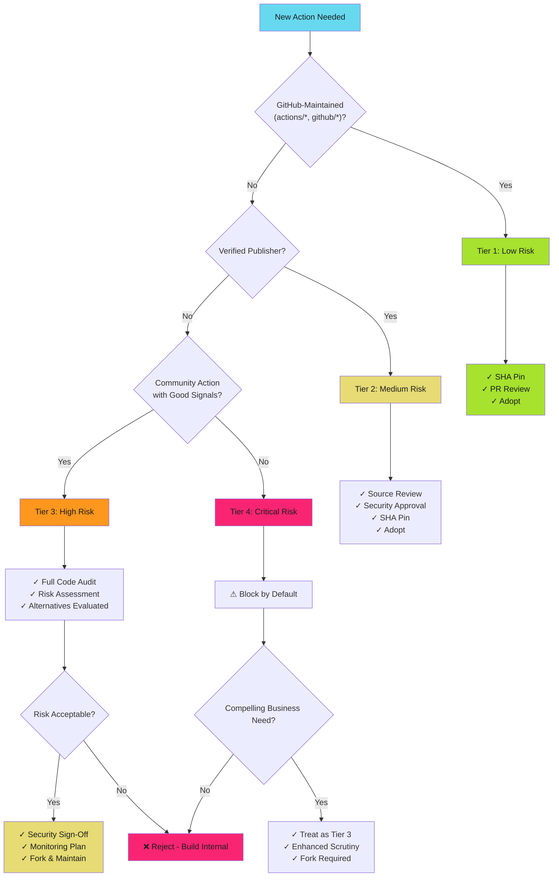

# Third-Party Action Risk Assessment - Reference

This is the complete reference documentation extracted from the source.


# Third-Party Action Risk Assessment

Trust but verify. Every third-party action you adopt into your workflows executes with access to your secrets, code, and deployment infrastructure. Know what you're trusting.

> **The Risk**
>
>
> Third-party actions run arbitrary code inside your CI/CD pipeline with full access to repository secrets, cloud credentials, and source code. A malicious or compromised action can exfiltrate everything, deploy backdoors, or modify your codebase.
>

## Why Risk Assessment Matters

GitHub Actions makes it trivial to import third-party code into your workflows. One line in a YAML file grants that action execution privileges in your environment. Without risk assessment, you're blind to:

1. **Who controls the action**: Individual developer? Corporate team? Unknown entity?
2. **Security posture of maintainer**: 2FA enabled? Org controls? Security team?
3. **Code quality and review**: Is source readable? Are dependencies safe? Active maintenance?
4. **Permission requirements**: What API scopes does it request? Are they justified?
5. **Historical security**: Past vulnerabilities? Disclosure process? Incident response?

**Reality**: Most teams add actions based on README quality and star count, not security analysis.

## The Third-Party Action Attack Surface



## Trust Tier Framework

Classify actions based on maintainer trustworthiness and security posture. Higher trust allows faster adoption. Lower trust requires deeper scrutiny.

### Tier 1: GitHub-Maintained Actions

**Examples**: `actions/checkout`, `actions/setup-node`, `actions/upload-artifact`, `actions/cache`, `github/codeql-action`

**Characteristics**:

- Published under `actions/*` or `github/*` namespaces
- Maintained by GitHub's internal teams
- Subject to GitHub's security review processes
- High-quality documentation and support
- Broad usage across millions of workflows

**Risk Level**: **Low**

**Adoption Process**:

1. SHA pin the action
2. Review changelog for new version
3. Standard PR review process
4. No additional security review required

**Recommendation**: Safe for general use. Still SHA pin to prevent tag mutation attacks.

### Tier 2: Verified Publisher Actions

**Examples**: `aws-actions/configure-aws-credentials`, `azure/login`, `google-github-actions/auth`, `docker/build-push-action`

**Characteristics**:

- Published by verified organizations (AWS, Azure, Google, Docker, etc.)
- Blue checkmark badge on GitHub Marketplace
- Corporate security teams responsible for maintenance
- Active development and security disclosure processes
- Widely adopted in enterprise environments

**Risk Level**: **Medium**

**Adoption Process**:

1. Verify publisher badge on GitHub Marketplace
2. Review action source code in repository
3. Check for active maintenance (recent commits, issue responses)
4. Review permission requirements
5. SHA pin the action
6. Security team approval for first use
7. Standard PR review for version updates

**Recommendation**: Generally safe with review. Require security sign-off for initial adoption.

### Tier 3: Community Actions

**Examples**: Individual developers, small teams, niche tools without verified publisher status

**Characteristics**:

- No verified publisher badge
- Maintained by individuals or small organizations
- Variable security posture and maintenance cadence
- May have limited documentation or support
- Unknown incident response capability

**Risk Level**: **High**

**Adoption Process**:

1. **Maintainer Review**: GitHub profile, 2FA status, other repositories, professional affiliation
2. **Code Review**: Full source audit, dependency review, suspicious patterns, build reproducibility
3. **Maintenance Assessment**: Last commit date, issue response, security policy, release cadence
4. **Permission Analysis**: Document requirements, verify justification, identify excessive scope
5. **Alternative Evaluation**: Can we build this? Are there Tier 1/2 alternatives? Fork internally?
6. **Security Approval**: Security team mandatory review, risk acceptance, monitoring plan
7. **Ongoing Monitoring**: Dependabot alerts, quarterly re-review, maintainer changes

**Recommendation**: High scrutiny. Prefer forking and internal maintenance for critical workflows.

See [Evaluation Criteria](evaluation.md) for detailed assessment process.

### Tier 4: Unknown/Unvetted Actions

**Examples**: Recently created actions, actions with minimal usage, suspicious patterns

**Characteristics**:

- New repository (< 6 months old)
- Low star count and minimal forks
- No clear maintainer identity
- Sparse documentation
- Requests excessive permissions
- Similar name to popular action (typosquatting)

**Risk Level**: **Critical**

**Adoption Process**:

1. **Block by default**: Use organization allowlist to prevent usage
2. **Thorough investigation**: If business need is compelling, treat as Tier 3 with additional scrutiny
3. **Build alternative**: Strongly prefer building internally or finding Tier 1/2 alternative
4. **Fork and audit**: If must use, fork to internal org, full security audit, maintain internally

**Recommendation**: Avoid. Block via organizational policies.

## Risk Assessment Checklist

Use this checklist before adopting any third-party action.

### Maintainer Trust

- [ ] Verified publisher badge (Tier 2) or GitHub-maintained namespace (Tier 1)?
- [ ] Active GitHub profile with real identity indicators?
- [ ] Organization affiliated or individual developer?
- [ ] 2FA enabled on maintainer account?
- [ ] Professional reputation verifiable?

### Repository Health

- [ ] Repository has > 100 stars and > 10 forks?
- [ ] Active maintenance (commits within last 3 months)?
- [ ] Issues responded to promptly (< 1 week average)?
- [ ] Release notes document changes clearly?
- [ ] Security policy documented (`SECURITY.md` exists)?

### Code Quality

- [ ] Source code is readable and understandable?
- [ ] Dependencies are minimal and from trusted sources?
- [ ] No obfuscated code or suspicious patterns?
- [ ] Build process is transparent and reproducible?
- [ ] Tests exist and pass?

### Security Posture

- [ ] Action source code audited for malicious behavior?
- [ ] Requested permissions are minimal and justified?
- [ ] No hardcoded credentials or secrets?
- [ ] Network calls are documented and necessary?
- [ ] Past vulnerabilities handled responsibly?

### Operational Risk

- [ ] Dependabot can monitor for updates?
- [ ] Forking action is feasible if maintainer disappears?
- [ ] Organization has process for removing action if needed?
- [ ] Alternative actions exist (no vendor lock-in)?
- [ ] Team has skills to maintain fork if required?

### Documentation Quality

- [ ] README explains what action does clearly?
- [ ] Input/output parameters documented?
- [ ] Example workflows provided?
- [ ] Permission requirements explained?
- [ ] Security considerations mentioned?

## Decision Tree for Action Adoption



## Security Best Practices

**Always SHA pin third-party actions**: Tag references can be mutated. SHA pins are immutable.

```yaml
# Bad - tag reference
- uses: community/action@v2

# Good - SHA pinned with version comment
- uses: community/action@a1b2c3d4e5f6...  # v2.1.0
```

**Review action source code before first use**: Never trust based on stars or README alone. Read the actual implementation.

**Fork critical actions to organization control**: Removes dependency on external maintainer. Gives you control over updates.

**Monitor for action updates**: Use Dependabot to track new versions. Review changelogs before updating.

**Minimize permissions**: Grant actions only what they need. Use job-level scoping to limit scope.

**Isolate high-risk workflows**: Run untrusted actions in separate jobs with minimal permissions and no secret access.

**Audit action usage quarterly**: Review which actions are in use. Re-assess risk as threat landscape evolves.

**Have an exit strategy**: Know how to replace or remove every action if it becomes compromised or unmaintained.

## Next Steps

Ready to implement action risk assessment? Continue with:

- **[Evaluation Criteria](evaluation.md)**: Detailed criteria and scoring system for action security review with step-by-step audit process
- **[Common Actions Review](common-actions.md)**: Pre-reviewed security assessment of frequently-used actions with known issues and safe usage patterns
- **[Allowlisting Guide](allowlisting.md)**: Step-by-step setup for organizational action policies, approval workflows, and enforcement mechanisms

## Quick Reference

### Trust Tiers

| Trust Tier | Risk Level | Adoption Process | Examples |
| ---------- | ---------- | ---------------- | -------- |
| **Tier 1: GitHub-Maintained** | Low | SHA pin + standard review | `actions/*`, `github/*` |
| **Tier 2: Verified Publishers** | Medium | Source review + security approval | `aws-actions/*`, `azure/*`, `google-github-actions/*` |
| **Tier 3: Community** | High | Full audit + fork + monitoring | Individual developers, small teams |
| **Tier 4: Unknown/Unvetted** | Critical | Block or treat as Tier 3+ | New repos, typosquatting, excessive permissions |

### Risk Assessment Quick Check

| Question | Safe Answer | Risk Answer |
| -------- | ----------- | ----------- |
| Verified publisher? | Yes | No |
| Active maintenance (< 3 months)? | Yes | No |
| Source code reviewed? | Yes | No |
| Minimal permissions requested? | Yes | No |
| Security policy documented? | Yes | No |
| Dependencies audited? | Yes | No |
| Fork feasible? | Yes | No |
| Alternatives exist? | Yes | No |

**If 6+ "Risk" answers**: Reject or require extensive mitigation before adoption.

---

> **Default to Distrust**
>
>
> Treat every third-party action as untrusted until proven otherwise. Even verified publishers can be compromised. SHA pin everything, review all source code for critical workflows, and maintain forks of essential actions under your organization's control.
>
