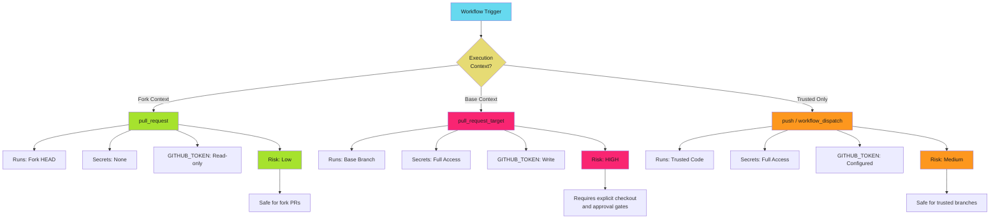

# Workflow Trigger Security - Examples


## Example 1: example-1.mermaid





## Example 2: example-2.yaml


```yaml
name: Fork CI
on:
  pull_request:
    branches: [main]

permissions:
  contents: read  # Explicit read-only

jobs:
  test:
    runs-on: ubuntu-latest
    steps:
      # Safe: Checkout fork PR code in isolated context
      - uses: actions/checkout@b4ffde65f46336ab88eb53be808477a3936bae11  # v4.1.1

      # Safe: No secrets, runs untrusted code
      - name: Run tests
        run: npm test

      # Safe: Read-only token cannot modify repository
      - name: Verify build
        run: npm run build
```


## Example 3: example-3.yaml


```yaml
# DO NOT USE THIS PATTERN - SEVERE SECURITY RISK
name: Dangerous PR Target
on:
  pull_request_target:  # Base context with secrets
    branches: [main]

jobs:
  deploy-preview:
    runs-on: ubuntu-latest
    steps:
      # DANGER: Checks out fork code in base context with secrets
      - uses: actions/checkout@b4ffde65f46336ab88eb53be808477a3936bae11  # v4.1.1
        with:
          ref: ${{ github.event.pull_request.head.sha }}

      # DANGER: Executes fork code with full secret access
      - run: npm run deploy-preview
        env:
          AWS_SECRET: ${{ secrets.AWS_SECRET }}
```


## Example 4: example-4.yaml


```yaml
name: Safe PR Target with Approval
on:
  pull_request_target:
    branches: [main]

permissions:
  pull-requests: write  # Only PR comments
  contents: read        # No repository modification

jobs:
  deploy-preview:
    runs-on: ubuntu-latest
    environment: pr-previews
    steps:
      - uses: actions/checkout@b4ffde65f46336ab88eb53be808477a3936bae11  # v4.1.1
        with:
          ref: ${{ github.event.pull_request.head.sha }}

      - uses: google-github-actions/auth@55bd3a7c6e2ae7cf1877fd1ccb9d54c0503c457c  # v2.1.2
        with:
          workload_identity_provider: ${{ secrets.WIF_PROVIDER }}
          service_account: ${{ secrets.WIF_SERVICE_ACCOUNT }}

      - run: npm run deploy-preview
```


## Example 5: example-5.yaml


```yaml
# Stage 1: Test fork code with pull_request
name: Fork Tests
on:
  pull_request:
    branches: [main]

permissions:
  contents: read

jobs:
  test:
    runs-on: ubuntu-latest
    steps:
      - uses: actions/checkout@b4ffde65f46336ab88eb53be808477a3936bae11  # v4.1.1
      - run: npm test
```


## Example 6: example-6.yaml


```yaml
# Stage 2: Post results with workflow_run
name: Post Test Results
on:
  workflow_run:
    workflows: ["Fork Tests"]
    types: [completed]

permissions:
  pull-requests: write
  contents: read

jobs:
  comment:
    runs-on: ubuntu-latest
    if: github.event.workflow_run.event == 'pull_request'
    steps:
      - uses: actions/github-script@60a0d83039c74a4aee543508d2ffcb1c3799cdea  # v7.0.1
        with:
          script: |
            await github.rest.issues.createComment({
              issue_number: ${{ github.event.workflow_run.pull_requests[0].number }},
              owner: context.repo.owner,
              repo: context.repo.repo,
              body: 'Tests completed. Check workflow run for results.'
            });
```


## Example 7: example-7.yaml


```yaml
name: Preview Deployment
on:
  pull_request_target:
    branches: [main]

permissions:
  contents: read
  pull-requests: write

jobs:
  deploy-preview:
    runs-on: ubuntu-latest
    environment: pr-previews
    steps:
      - uses: actions/checkout@b4ffde65f46336ab88eb53be808477a3936bae11  # v4.1.1
        with:
          ref: ${{ github.event.pull_request.head.sha }}

      - uses: google-github-actions/auth@55bd3a7c6e2ae7cf1877fd1ccb9d54c0503c457c  # v2.1.2
        with:
          workload_identity_provider: ${{ secrets.WIF_PROVIDER }}
          service_account: ${{ secrets.WIF_SERVICE_ACCOUNT }}

      - run: npm run deploy-preview
```


## Example 8: example-8.yaml


```yaml
name: Fork Security Scan
on:
```


